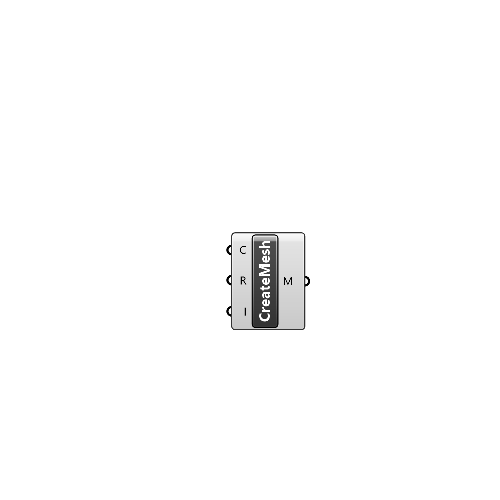

##  CreateMesh

Creates a mesh from point and face data in .txt files

#### Input
* ##### C 
UMCF Case class to extract the working directory
* ##### R 
UMCF Case region to visualize
* ##### I 
List of face indices to visualize (optional)

#### Output
* ##### M
Generated unified mesh