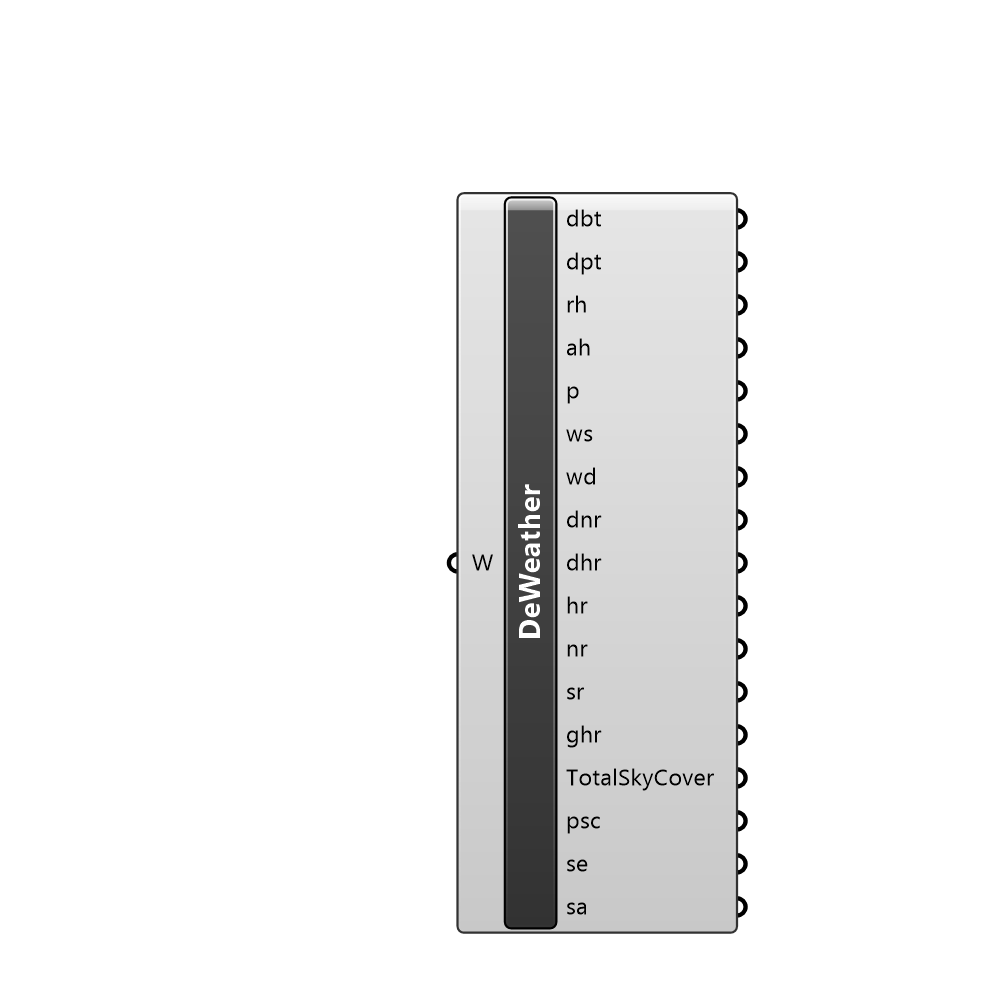

##  Deconstruct Weather

Deconstructs a Weather instance, exposing the weather information.

#### Input
* ##### W 
Weather instance

#### Output
* ##### dbt
DryBulbTemp
* ##### dpt
DewPointTemp
* ##### rh
RelativeHumidity
* ##### ah
AbsoluteHumidity
* ##### p
Pressure
* ##### ws
WindSpeed
* ##### wd
WindDirection
* ##### dnr
DirectNormalRadiation
* ##### dhr
DiffuseHorizontalRadiation
* ##### hr
HorRadiation
* ##### nr
NormalRadiation
* ##### sr
SkyRadiation
* ##### ghr
GHorRadiation
* ##### TotalSkyCover
tsc
* ##### psc
OpaqSkyCover
* ##### se
SolarElevation
* ##### sa
SolarAzi