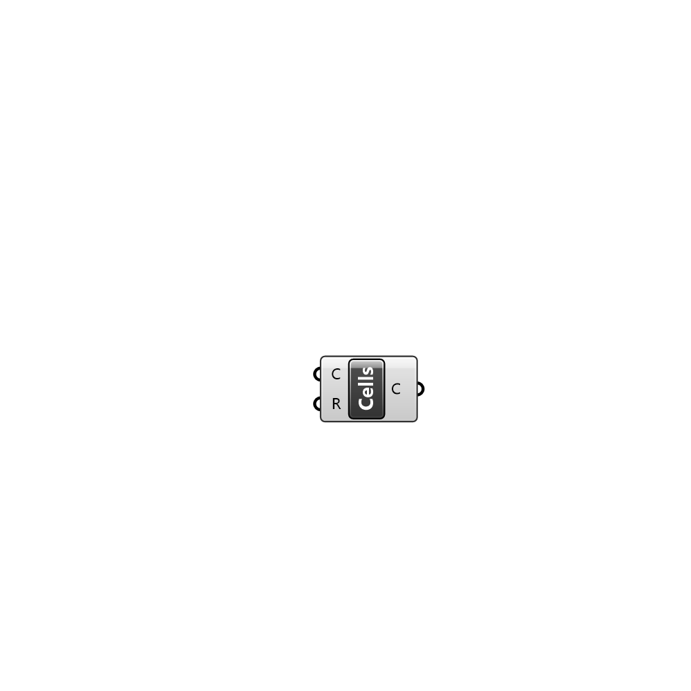

##  Get Cells

Group of mesh faces based on indices from owner and neighbour files

#### Input
* ##### C 
UMCF Case class to extract the working directory
* ##### R 
UMCF Case region to visualize

#### Output
* ##### C
List of cells containing a list of indices pointing to mesh faces