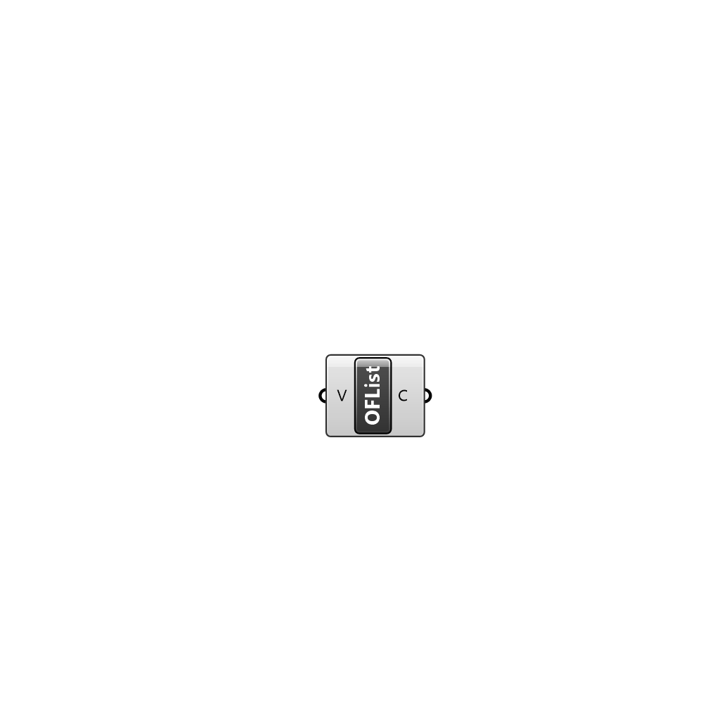

##  OpenFOAM List

Creates an OpenFOAM list. Used as an input to modify OpenFOAM files

#### Input
* ##### V 
List of values to store in the OF Dictionary.

#### Output
* ##### C
The created collection.