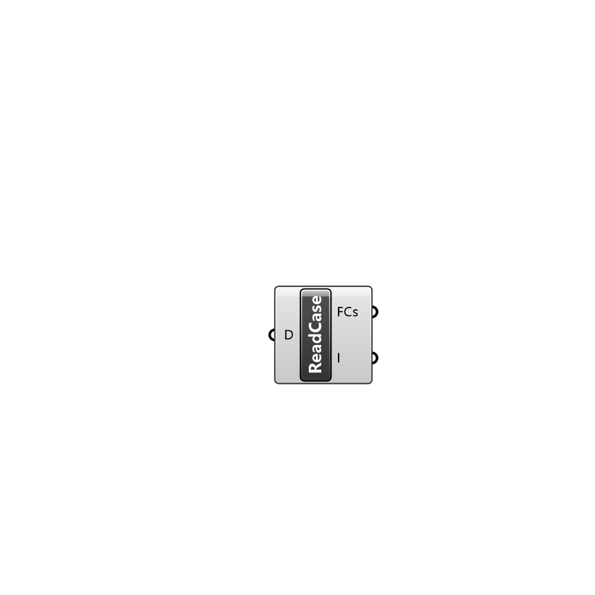

##  Read OpenFOAM Case

Reads an OpenFOAM case and outputs a Case instance with all its files.

#### Input
* ##### D 
Directory to OpenFOAM case.

#### Output
* ##### FCs
File Containers found in the case.
* ##### I
Names of files in the directory that were not `added to the case