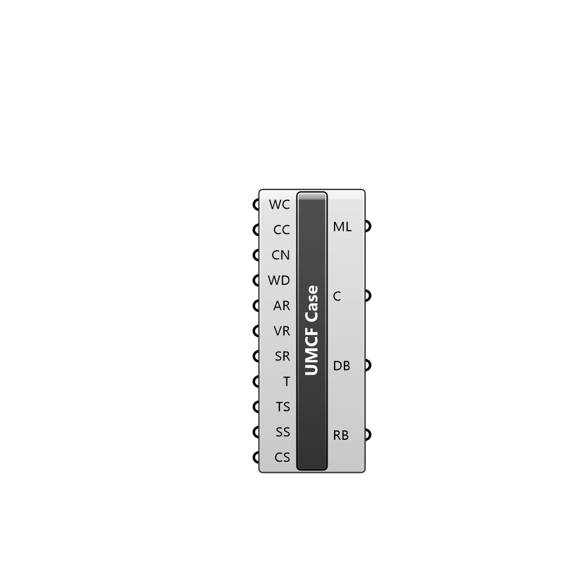

##  UrbanMicroClimateFoam Case

Creates an UMCF case

#### Input
* ##### WC 
Set to true to write the case in the working directory
* ##### CC 
Set to true to remove all files in the working directory
* ##### CN 
Name of the new case to create. It cannot contain spaces
* ##### WD 
Working directory to place the case files and results
* ##### AR 
Air region for this case
* ##### VR 
Vegetation region of this case
* ##### SR 
Solid regions of this case
* ##### T 
Terrain region of this simulation
* ##### TS 
Case timing settings
* ##### SS 
Simulation settings
* ##### CS 
Optional input for optinal entries

#### Output
* ##### ML
Case modification logs
* ##### C
Modified case
* ##### DB
Case domain
* ##### RB
Refinement box of the case