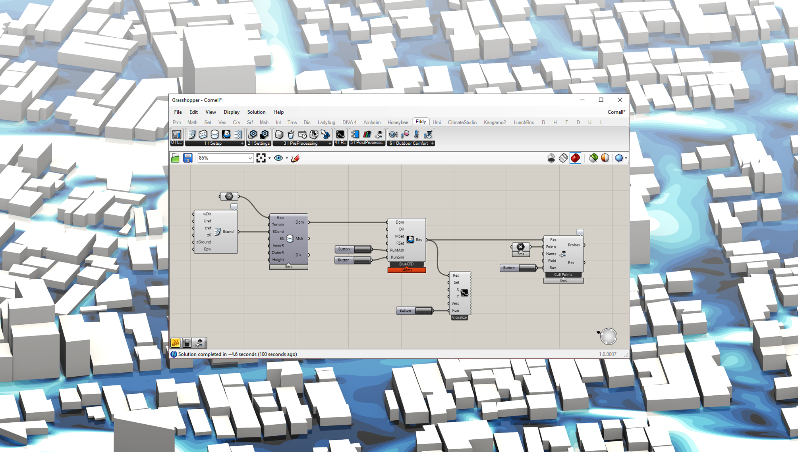

---
hide:
  - navigation
  - toc
---

# 

## Airflow and Microclimate Simulations for Rhino & Grasshopper

  <a href="documentation/getting-started/" class="md-button md-button--primary">Get Started</a>
  <a href="https://www.eddy3d.com/wordpress/download-information/" class="md-button">Download</a>

---

## 🚀 Features

### User-Friendliness  
Clean and easy-to-use UI for urban wind flow analysis.  

### Built for Real-World Applications  
Add realistic terrain to your simulation setup.  

### Outdoor Thermal Comfort  
Annual outdoor thermal comfort assessment for climate-responsive master planning.  

### Seamless Integration  
Post-processing of custom surfaces for **EnergyPlus Air Flow Network**.  

---

## 🎓 Publications

We contribute to research in computational fluid dynamics and urban climate modeling.

- **Eddy3D: A toolkit for decoupled outdoor thermal comfort simulations in urban areas**  
  [Read Paper](https://www.researchgate.net/publication/356780551_Eddy3D_A_toolkit_for_decoupled_outdoor_thermal_comfort_simulations_in_urban_areas)

- **Modeling outdoor thermal comfort along cycling routes**  
  [Read Paper](https://www.researchgate.net/publication/356303248_Modeling_outdoor_thermal_comfort_along_cycling_routes)

[📚 See More Publications](https://www.researchgate.net/profile/Patrick-Kastner)

---

## 👥 Team

|  |  |
|------------------------------------------------------|------------------------------------------------------|
| **[Patrick Kastner](https://www.linkedin.com/in/patrickkastner/)** | **[Remy Mermelstein](https://www.linkedin.com/in/remy-mermelstein/)** |

|  |  |
|-----------------------------------------------|-----------------------------------------------|
| **[Zoe De Simone](https://www.linkedin.com/in/zoedesimone/)** | **[Timur Dogan](https://www.linkedin.com/in/timur-dogan-b28340a9)** |

---

## 📬 Contact

Have questions? Reach out to us!  

📧 Email: [contact@eddy3d.com](mailto:contact@eddy3d.com)  
🌐 Website: [eddy3d.com](https://www.eddy3d.com)  
🔗 LinkedIn: [Eddy3D on LinkedIn](https://www.linkedin.com/company/eddy3d)

---

🎉 **Supported By:**
  
  

