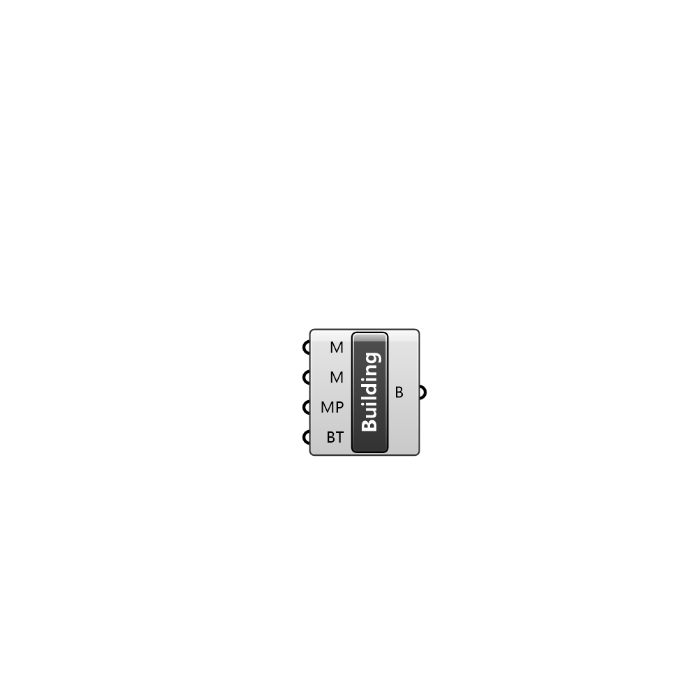

##  Building Region

Building Region

#### Input
* ##### M 
Mesh of this building
* ##### M 
Material parameters of this building
* ##### MP 
Building mesh parameters
* ##### BT 
Temperature inside the building in Celcius. This value stays constant for the entire simulation time

#### Output
* ##### B
Building region.