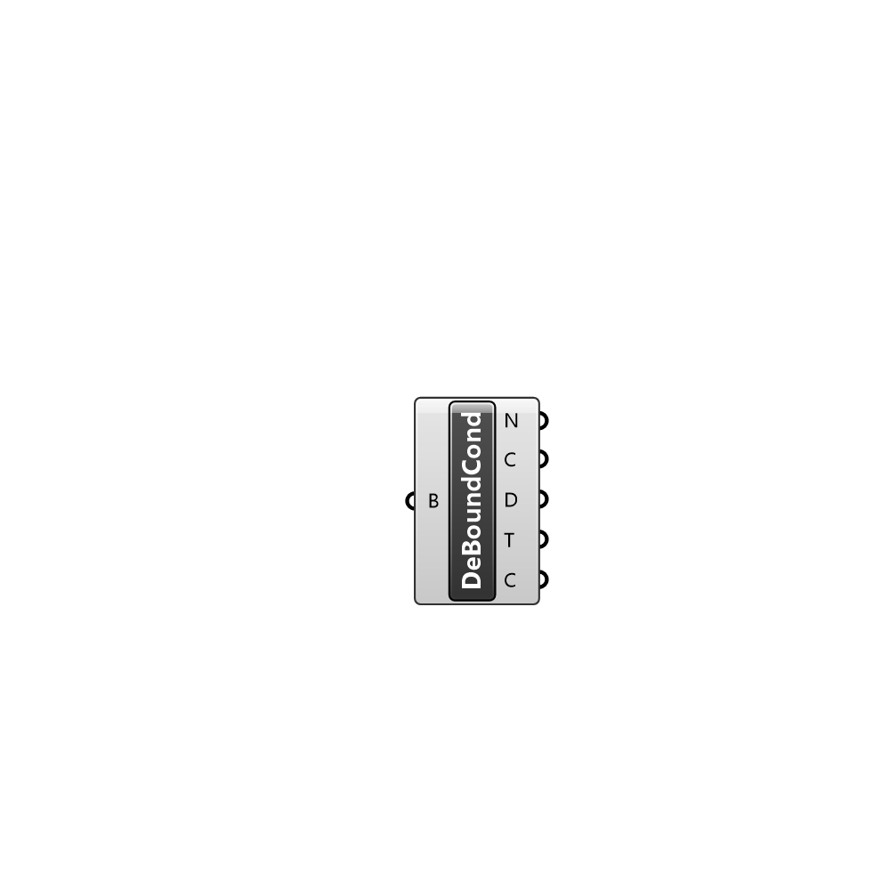

##  Deconstruct Boundary Condition

Deconstrunct a boundary condition instance.

#### Input
* ##### B 
Boundary condition to deconstruct.

#### Output
* ##### N
Name.
* ##### C
Class.
* ##### D
Description.
* ##### T
Type.
* ##### C
Content.