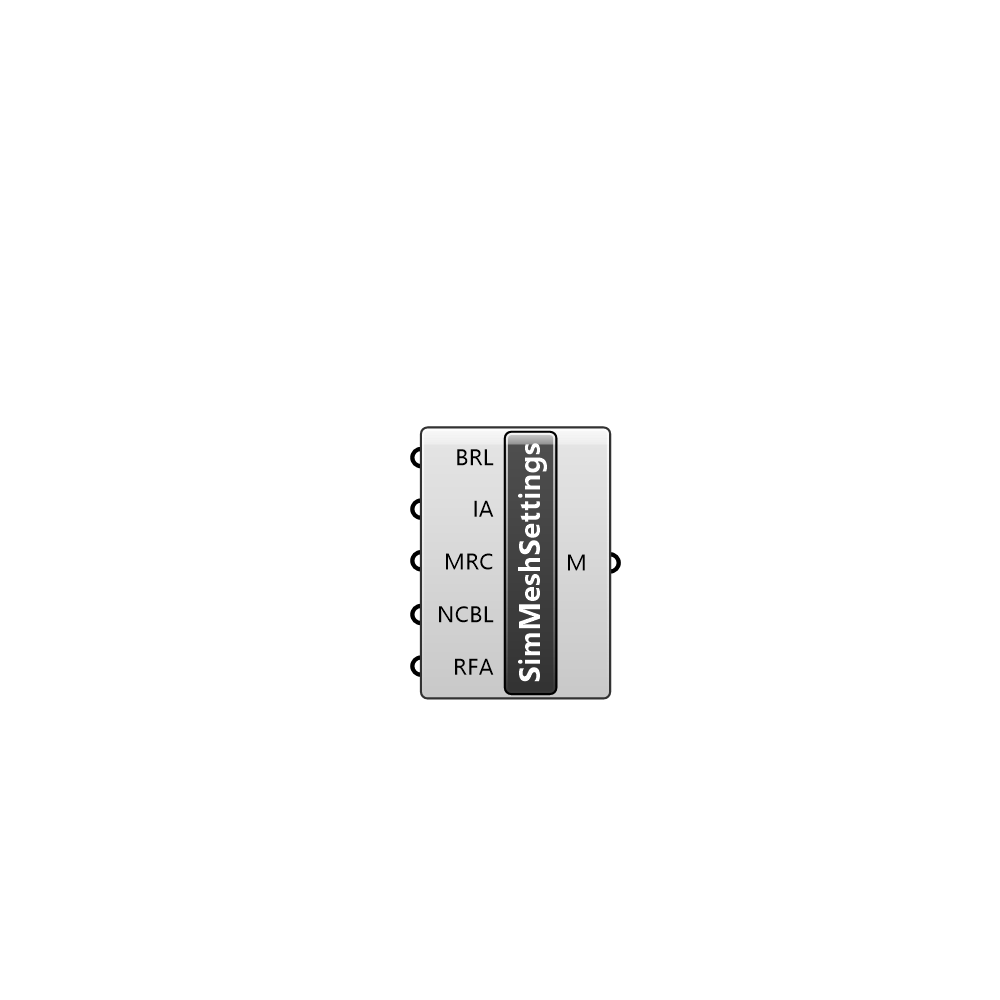

##  Simulation MeshSettings

Simulation mesh settings.

#### Input
* ##### BRL 
Refinement level inside refinement box
* ##### IA 
Identify a feature when angle between faces < includedAngle
* ##### MRC 
Minimum refinement of cells
* ##### NCBL 
Number of cells between levels
* ##### RFA 
Resolve feature angle

#### Output
* ##### M
Simulation mesh settings.