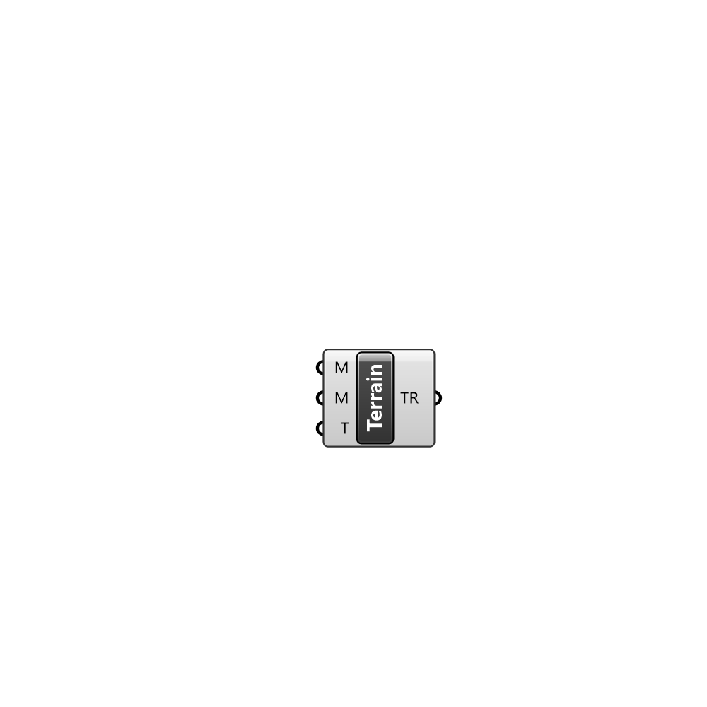

##  Terrain Region

Creates a terrain region

#### Input
* ##### M 
Mesh representing the terrain
* ##### M 
Material parameters
* ##### T 
Temperature of the terrain

#### Output
* ##### TR
The created terrain region