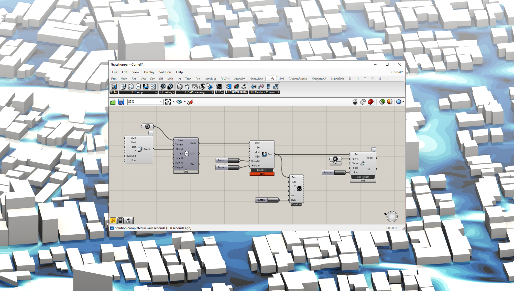
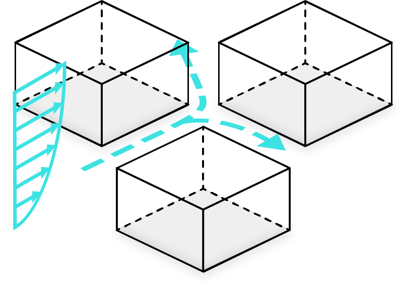
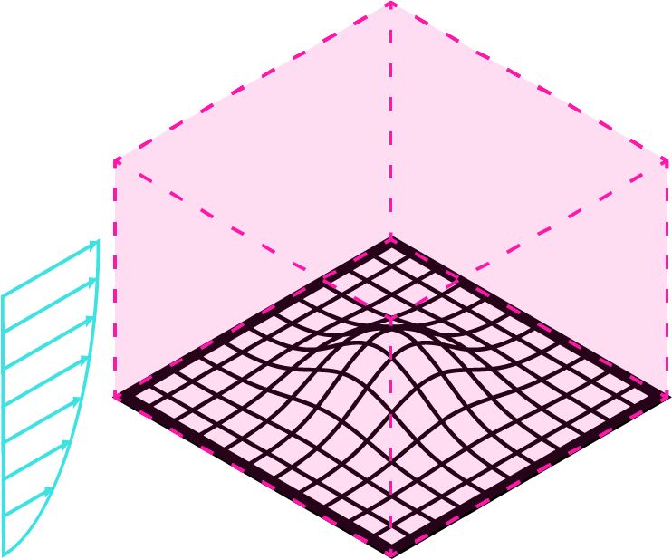
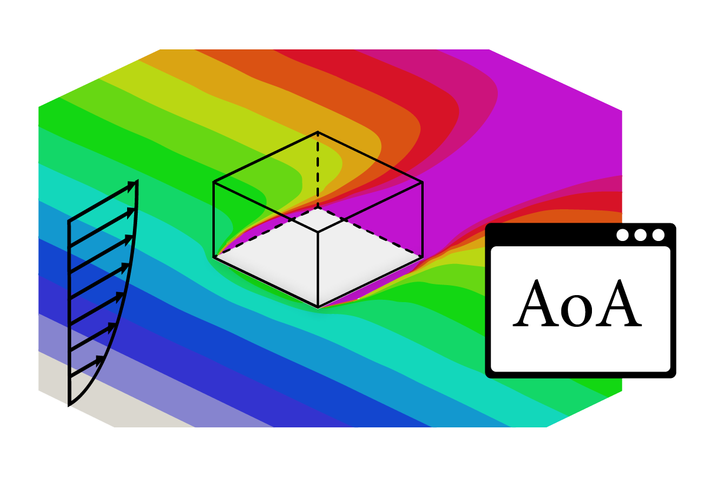
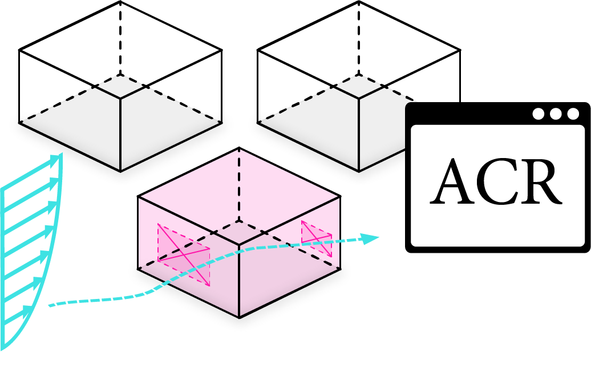
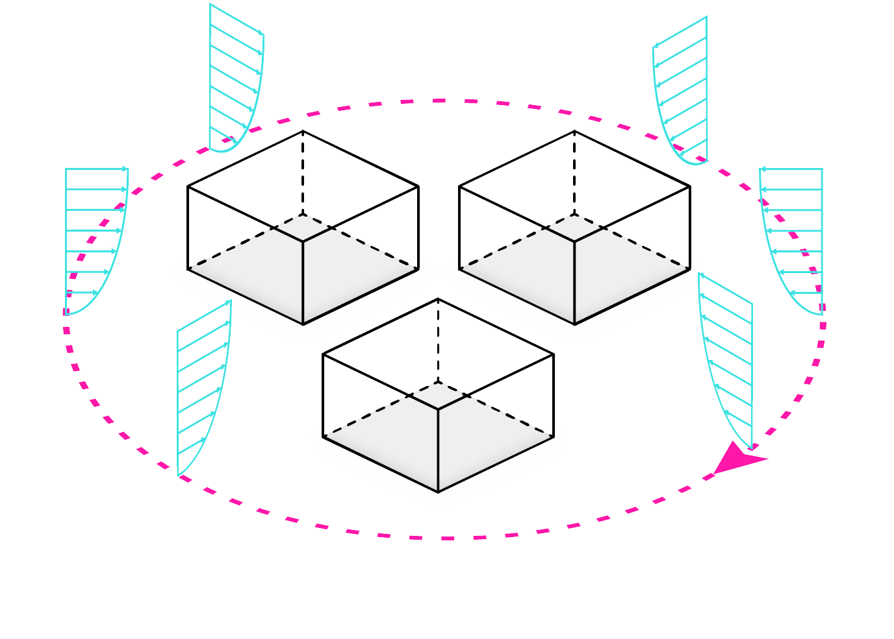
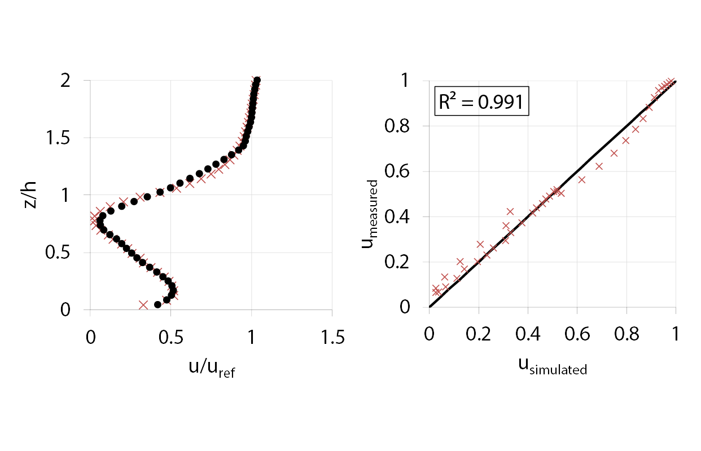
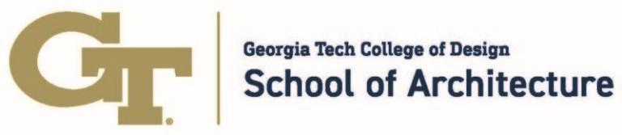
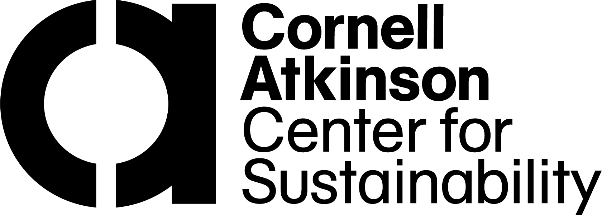

---
hide:
  - navigation
  - toc
---

<figure markdown="span">
  { width="250" .skip-lightbox }
</figure>

  Airflow and Microclimate Simulations for Rhino & Grasshopper

 

{.skip-lightbox}

  <a href="https://docs.eddy3d.com/" class="md-button md-button--primary">Get Started</a>
  <a href="download/" class="md-button">Download</a>

---

## 🚀 Features

-   { width="300" loading=lazy .skip-lightbox  .center}

    ---

    __USER-FRIENDLINESS__
    
    Clean and easy-to-use UI for urban wind flow analysis.

-   { width="255" loading=lazy .skip-lightbox  .center} 

    ---

    __BUILT FOR REAL WORLD APPLICATIONS__

    Add realistic terrain to your simulation setup.

-   { width="410" loading=lazy .skip-lightbox  .center} 

    ---
    __OUTDOOR THERMAL COMFORT__

    Annual outdoor thermal comfort assessment for climate-responsive masterplanning.
 
-   { width="300" loading=lazy .skip-lightbox  .center} 
     

    ---
    __SEAMLESS INTEGRATION__

    Post-processing of custom surfaces for Air Flow Network integration into EnergyPlus.
  
-   { width="350" loading=lazy .skip-lightbox  .center}  
    

    ---
    __STREAMLINED SIMULATION SETUP__

    Urban turntable for fast outdoor airflow analysis.

-   { width="450" loading=lazy .skip-lightbox  .center} 
    

    ---
     __VALIDATED SIMULATION ENGINE__

    Accurate results by using well-established solvers.
  

---

## 🎓 Publications

- [Kastner, P., & Dogan, T. (2021). *Eddy3D: A toolkit for decoupled outdoor thermal comfort simulations in urban areas*. Building and Environment](https://www.researchgate.net/publication/356780551_Eddy3D_A_toolkit_for_decoupled_outdoor_thermal_comfort_simulations_in_urban_areas).

- [Young, E., Kastner, P., Dogan, T., Chokhachian, A., Mokhtar, S., & Reinhart, C. (2021). *Modeling outdoor thermal comfort along cycling routes at varying levels of physical accuracy to predict bike ridership in Cambridge, MA*. Building and Environment.](https://www.researchgate.net/publication/356303248_Modeling_outdoor_thermal_comfort_along_cycling_routes_at_varying_levels_of_physical_accuracy_to_predict_bike_ridership_in_Cambridge_MA)  

- [De Simone, Z., Kastner, P., Dogan, T. (2021). *Towards Safer Work Environments During the COVID-19 Crisis: A Study of Different Floor Plan Layouts and Ventilation Strategies Coupling Open FOAM and Airborne Pathogen Data for Actionable, Simulation-based Feedback in Design.* Building Simulation 2021 Conference.](https://www.researchgate.net/publication/351880927_Towards_Safer_Work_Environments_During_the_COVID-19_Crisis_A_Study_Of_Different_Floor_Plan_Layouts_and_Ventilation_Strategies_Coupling_Open_FOAM_and_Airborne_Pathogen_Data_for_Actionable_Simulation-ba)

- [Dogan, T., Kastner, P., Mermelstein, R. (2021). *Surfer: A fast simulation algorithm to predict surface temperatures and mean radiant temperatures in large urban models.* Journal of Building and Environment.](https://www.researchgate.net/publication/350385969_Surfer_A_fast_simulation_algorithm_to_predict_surface_temperatures_and_mean_radiant_temperatures_in_large_urban_models)

- [Dogan, T., Kastner, P. (2020). *Streamlined CFD simulation framework to generate wind-pressure coefficients on building facades for airflow network simulations. Journal of Building Simulation.*](https://www.researchgate.net/publication/345942538_Streamlined_CFD_simulation_framework_to_generate_wind-pressure_coefficients_on_building_facades_for_airflow_network_simulations)

- [Natanian, J., Kastner, P., Dogan T., Auer T. (2020). *From energy performative to livable Mediterranean cities: An annual outdoor thermal comfort and energy balance cross-climatic typological study. Energy & Buildings.*](https://www.researchgate.net/publication/342764084_From_Energy_Performative_to_Livable_Mediterranean_Cities_An_Annual_Outdoor_Thermal_Comfort_and_Energy_Balance_Cross-Climatic_Typological_Study)

- [Kastner, P., Dogan, T. (2020). *Predicting space usage by multi-objective assessment of outdoor thermal comfort around a university campus.* Proceedings of SimAUD 2020.](https://www.researchgate.net/publication/346039200_Predicting_space_usage_by_multi-objective_assessment_of_outdoor_thermal_comfort_around_a_university_campus)

- [Kastner, P., Dogan, T. (2020). *Solving Thermal Bridging Problems for Architectural Applications with OpenFOAM.* Proceedings of SimAUD 2020.](https://www.researchgate.net/publication/346039320_Solving_Thermal_Bridging_Problems_for_Architectural_Applications_with_OpenFOAM)

- [Kastner, P., Dogan, T. (2019). *A cylindrical meshing methodology for annual urban computational fluid dynamics simulations.* Journal of Building Performance Simulation, 13(1), 59-68.](https://www.researchgate.net/publication/338030136_A_cylindrical_meshing_methodology_for_annual_urban_computational_fluid_dynamics_simulations)

- [Kastner, P., Dogan, T. (2019). *Towards High-Resolution Annual Outdoor Thermal Comfort Mapping In Urban Design.* Building Simulation 2019 Conference.](https://www.researchgate.net/publication/340463509_Towards_High-Resolution_Annual_Outdoor_Thermal_Comfort_Mapping_In_Urban_Design)

- [Kastner, P., Dogan, T. (2018). *Streamlining meshing methodologies for annual urban CFD simulations.* Proceedings of eSim 2018.](https://www.researchgate.net/publication/325023244_Streamlining_meshing_methodologies_for_annual_urban_CFD_simulations)

- [Dogan, T., Kastner, P. (2018). *Streamlined CFD Simulation Framework to Generate Wind-Pressure Coefficients on Building Facades for Airflow Network Simulations.* Proceedings of IBPC 2018.](https://www.researchgate.net/publication/328028506_Streamlined_CFD_Simulation_Framework_to_Generate_Wind-Pressure_Coefficients_on_Building_Facades_for_Airflow_Network_Simulations)

---

## 👥 Team

<figure class="mdx-users__testimonial black-and-white">
    
    <figcaption class="md-typeset">Patrick Kastner</figcaption>
  </figure>

<figure class="mdx-users__testimonial black-and-white">
    
    <figcaption class="md-typeset">Sina Rahimi</figcaption>
  </figure>
  
  <figure class="mdx-users__testimonial black-and-white">
    
    <figcaption class="md-typeset">Gonzalo Vegas</figcaption>
  </figure>
  
   <figure class="mdx-users__testimonial black-and-white">
    
    <figcaption class="md-typeset">Marcelo Álvarez</figcaption>
  </figure>

<figure class="mdx-users__testimonial black-and-white">
    
    <figcaption class="md-typeset">Timur Dogan</figcaption>
  </figure>

## 👥 Advisors & Alumni 

<figure class="mdx-users__testimonial black-and-white">
    
    <figcaption class="md-typeset">Tobias Holzmann</figcaption>
  </figure>
 
<figure class="mdx-users__testimonial black-and-white">
    
    <figcaption class="md-typeset">Remy Mermelstein</figcaption>
  </figure>

<figure class="mdx-users__testimonial black-and-white">
    
    <figcaption class="md-typeset">Zoe De Simone</figcaption>
  </figure>

---

{width="350" .skip-lightbox align=left loading=lazy}  
{width="320" .skip-lightbox align=right loading=lazy}

:octicons-plus-24:

   

Eddy3D is being developed as a cross-disciplinary project through a collaboration between the Georgia Tech School of Architecture, the Environmental Systems Lab at Cornell AAP, and the Systems Engineering department at Cornell Engineering.

---

## 🎉 Supporters

              

{width="250" .skip-lightbox loading=lazy .center}
{ .card }

{width="250" .skip-lightbox loading=lazy .center}
{ .card }

{width="75" .skip-lightbox loading=lazy .center} 
{ .card }

{width="75" .skip-lightbox loading=lazy .center} 
{ .card }

{width="200", .skip-lightbox loading=lazy .center}
{ .card }

{width="250" .skip-lightbox, .center}
{ .card }

