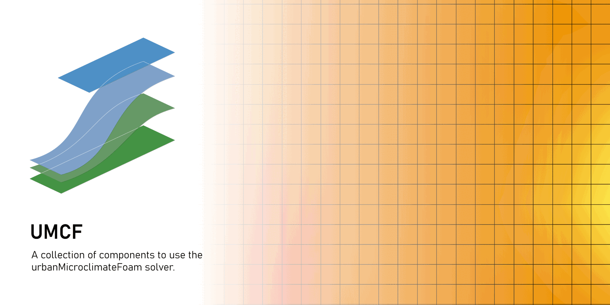
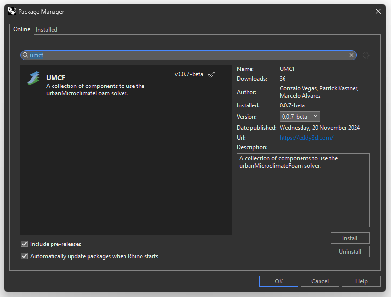
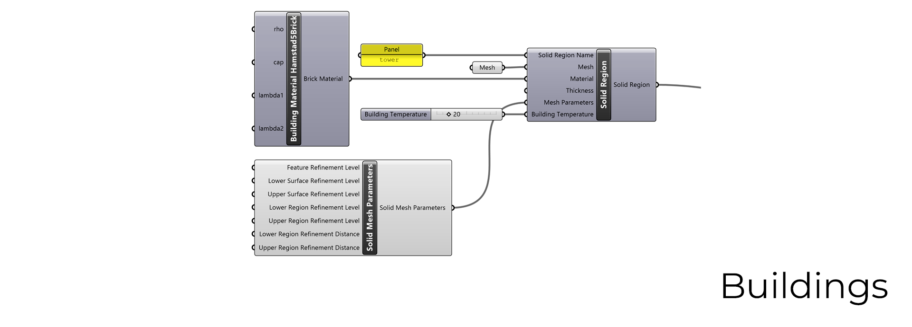
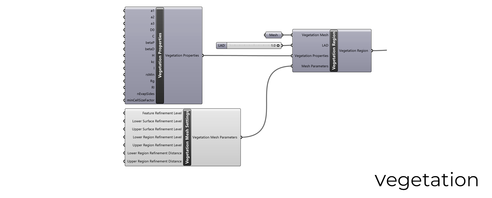

# UMCF

### A Grasshopper plugin for microclimate simulations

## Overview

**UMCF** (`urbanMicroclimateFoam`) is an open-source solver for coupled physical processes modeling urban microclimate based on `OpenFOAM`.

### Key Features

 **CFD** - Computational fluid dynamics model
- Solves turbulent, convective airflow
- Handles heat and moisture transport in the `air` subdomain

 **HAM** - Heat moisture transport model
- Manages absorption and transport
- Controls storage of heat and moisture in porous building materials

 **RAD** - Radiation model
- Calculates net longwave and shortwave radiative heat fluxes
- Uses view factor approach

 **VEG** - Vegetation model
- Solves heat balance for urban trees
- Handles green surfaces

## Installation

### Prerequisites
- `bluecfd core 2020`
- `UMCF` plugin from `PackageManager`
- `CheckInstallation` component

### Step-by-Step Guide

1. **Install blueCFD-Core**
   - Download `blueCFD-Core-2020-1-win64-setup.exe` from [bluecfd.github.io](https://bluecfd.github.io/Core/Downloads/#bluecfd-core-2020-1)
   - This provides `OpenFOAM 8`

2. **Install UMCF Plugin**
   - In `Rhinoceros`, execute `PackageManager` command
   - Search for `UMCF` and click Install ([View on RhinoPackages](https://www.rhinopackages.com/?search=umcf))
   - Optional: Check `Include pre-releases` for all versions
   - Restart `Rhinoceros` to complete installation

   

3. **Verify Installation**
   - Navigate to `UMCF` tab in `Grasshopper` ribbon
   - Find `Check Installation` under `Meta` subcategory
   - Set `Check` input to `True`
   - This verifies integrity of `blueCDF-Core 2020` and `urbanMicroclimateFoam` files

   

## Features & Workflow

### 1. Simulation Domain Configuration
The simulation domain consists of three regions:
   1. `air` region
   2. `solid` region
   3. `vegetation` region

### 2. Air Region Setup
Managed by `UMCF.AirRegion` class
- Determined by `Box Domain Dimensions`
- Includes `Atmospheric Boundary Layer` (`ABL`) condition:
  - `Wind Speed`
  - `Height`
  - `Wind Direction`

### 3. Solid Region Setup
Managed by `UMCF.SolidRegion` class
- Requires `mesh` geometry input
- Stores:
 - `region name`
 - `material`
 - Optional `thickness` value
 - `mesh parameters`
 - `building temperature`

### 4. Vegetation Region Configuration
Managed by `UMCF.VegetationRegion
- Requirements:
 - `mesh` geometry input
 - `Leaf Area Density` (`LAD`)
 - `vegetation properties`
 - `mesh parameters

### 5. Timing Parameters
Uses `EnergyPlus Weather` file (`.EPW`)
- Requires:
 - `start day` (365-day based)
 - `start time
 - `duration
 - `end time` is calculated by adding the `start time` and `duration`

### 6. Simulation Settings
Key parameters include:
 - `Number of CPUs` (`N`)
 - `maxFluidIterations` (`F`)
 - `Write Interval` (`W`)
 - `Initial Solid Timestep Factor` (`I`)
 - `minDeltaT` (`T`)
 - `maxDeltaT` (`T`)
 - `minFluidIteration` (`F`)
 - `pcEqnForm` (`p`)
 - `dampingThickness` (`d`)
 - `alphaCoefU` (`U`)
 - `alphaCoefT` (`T`)

### 7. Case Generation
- Connect all configured components
- Set `Write Case` to `True`
- Outputs `UMCF.UMCFCase` which must be connected to the `Case Run` component

### 8. Simulation Execution
- Two-step process:
 - 1. Prepare simulation: Set `Prepare Simulation` or `Prepare Simulation in Parallel` to `True`
 - 2. Run Simulation: Set `Run Simulation` or `Run Simulation in Parallel` to `True`

 Note: Use consistent parallel settings for preparation and execution

### 9. Analysis & Visualization
- Uses `probing` component
- Samples field values at point locations
- Writes results to file using input fields
- Enables value analysis and visualization by running the `probes` function

## Documentation

[UMCF Component list](}text/README.md)

## Presentation

## Team

| Name | Seniority | Major | Department | GitHub |
|------|-----------|-------|------------|---------|
| Marcelo Alvarez | Masters | Architecture (DC) | ARCH | [@alvarezdmarch](https://github.com/alvarezdmarch) |
| Gonzalo Vegas | PhD | Architecture | ARCH | [@gvegaso](https://github.com/gvegasol) |
| Shruti Jadhav | Masters | Architecture (HBP) | ARCH | [@ShrutiJadhav27](https://github.com/ShrutiJadhav27) |
| Rui Shen | Masters | Architecture (DC) | ARCH | [@ShiRo-25](https://github.com/ShiRo-25) |
| Chinmay Rothe | Masters | Architecture (HBP) | ARCH | [@ChinmayR5](https://github.com/ChinmayR5) |
