---
hide:
  - navigation
  - toc
---

# Eddy3D

<figure class="hero-logo" markdown="span">
  { width="250" .skip-lightbox .hero-logo__image }
</figure>

  Airflow and Microclimate Simulations for Rhino & Grasshopper

 

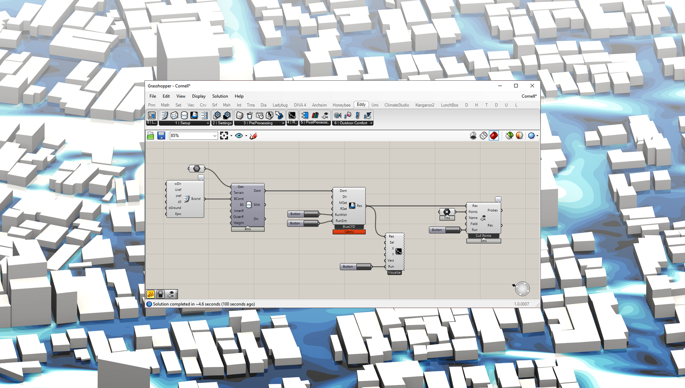{.skip-lightbox}

  <a href="https://docs.eddy3d.com/" class="md-button md-button--primary" aria-label="Get Started with Eddy3D Documentation">Get Started</a>
  <a href="download/" class="md-button" aria-label="Download Eddy3D">Download</a>

  Latest stable release and pre-release builds are listed on the <a href="download/">download page</a>.

---

## 🚀 Features

-   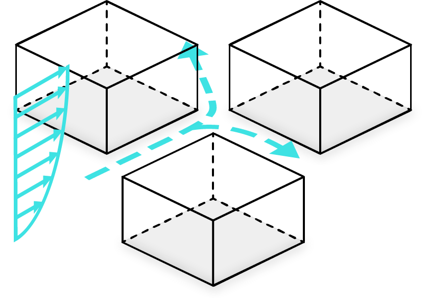{ width="300" loading=lazy .skip-lightbox  .center}

    ---

    __USER-FRIENDLINESS__
    
    Clean and easy-to-use UI for urban wind flow analysis.

-   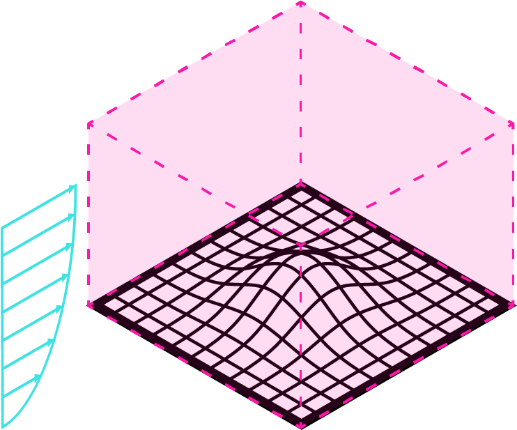{ width="255" loading=lazy .skip-lightbox  .center}

    ---

    __BUILT FOR REAL WORLD APPLICATIONS__

    Add realistic terrain to your simulation setup.

-   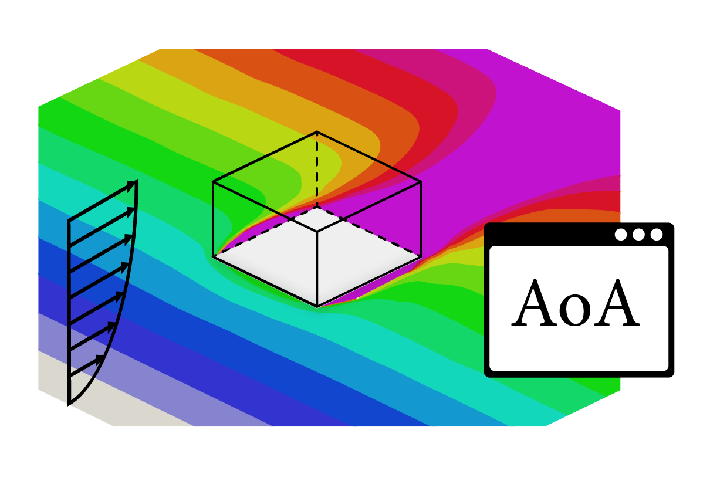{ width="410" loading=lazy .skip-lightbox  .center}

    ---
    __OUTDOOR THERMAL COMFORT__

    Annual outdoor thermal comfort assessment for climate-responsive masterplanning.
 
-   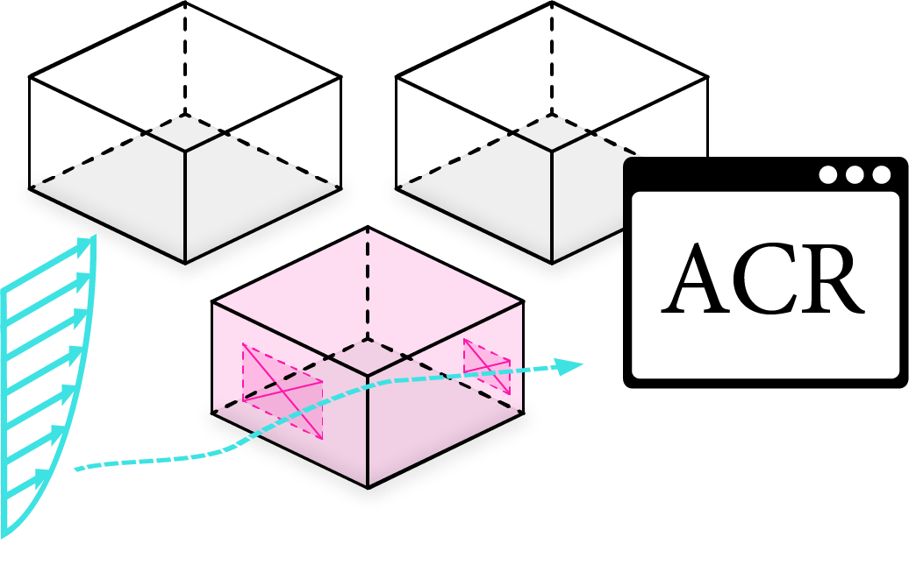{ width="300" loading=lazy .skip-lightbox  .center}
     

    ---
    __SEAMLESS INTEGRATION__

    Post-processing of custom surfaces for Air Flow Network integration into EnergyPlus.
  
-   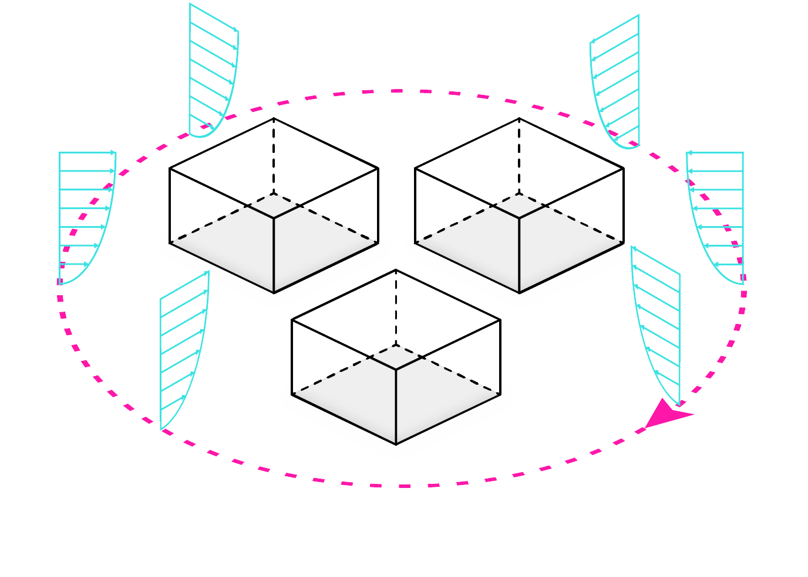{ width="350" loading=lazy .skip-lightbox  .center}
    

    ---
    __STREAMLINED SIMULATION SETUP__

    Urban turntable for fast outdoor airflow analysis.

-   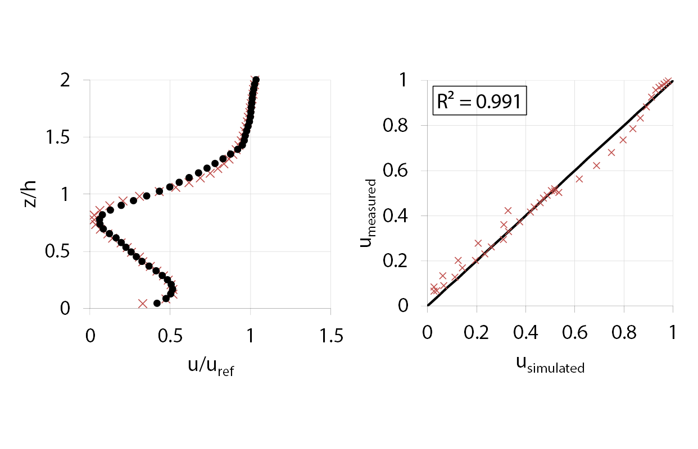{ width="450" loading=lazy .skip-lightbox  .center}
    

    ---
     __VALIDATED SIMULATION ENGINE__

    Accurate results by using well-established solvers.
  

---

## 👥 Team

<figure class="mdx-users__testimonial black-and-white">
    
    <figcaption class="md-typeset">Patrick Kastner</figcaption>
  </figure>

<figure class="mdx-users__testimonial black-and-white">
    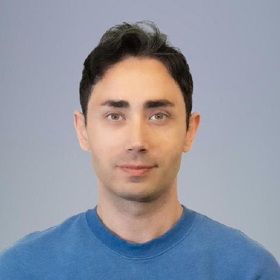
    <figcaption class="md-typeset">İlker Karadağ</figcaption>
  </figure>

<figure class="mdx-users__testimonial black-and-white">
    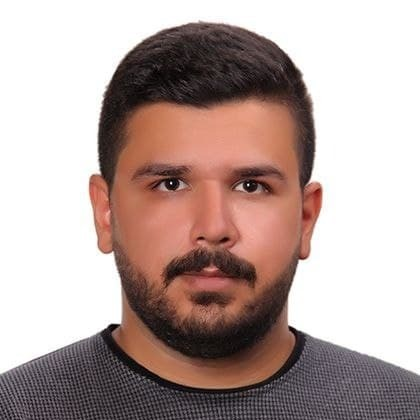
    <figcaption class="md-typeset">Sina Rahimi</figcaption>
  </figure>
  
  <figure class="mdx-users__testimonial black-and-white">
    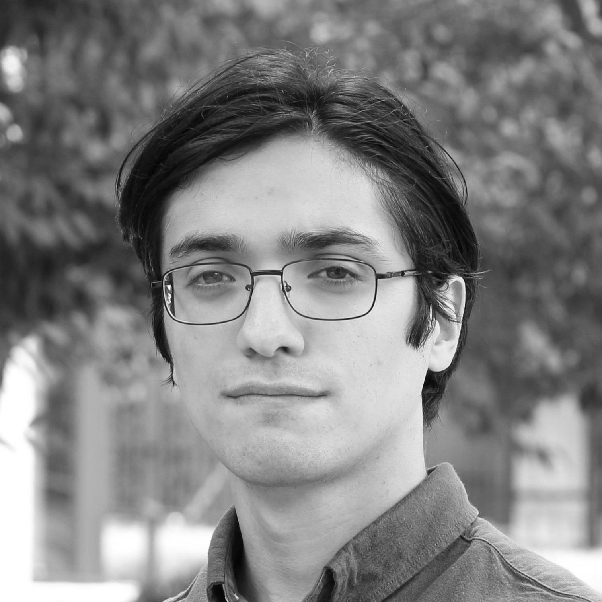
    <figcaption class="md-typeset">Gonzalo Vegas</figcaption>
  </figure>
  
   <figure class="mdx-users__testimonial black-and-white">
    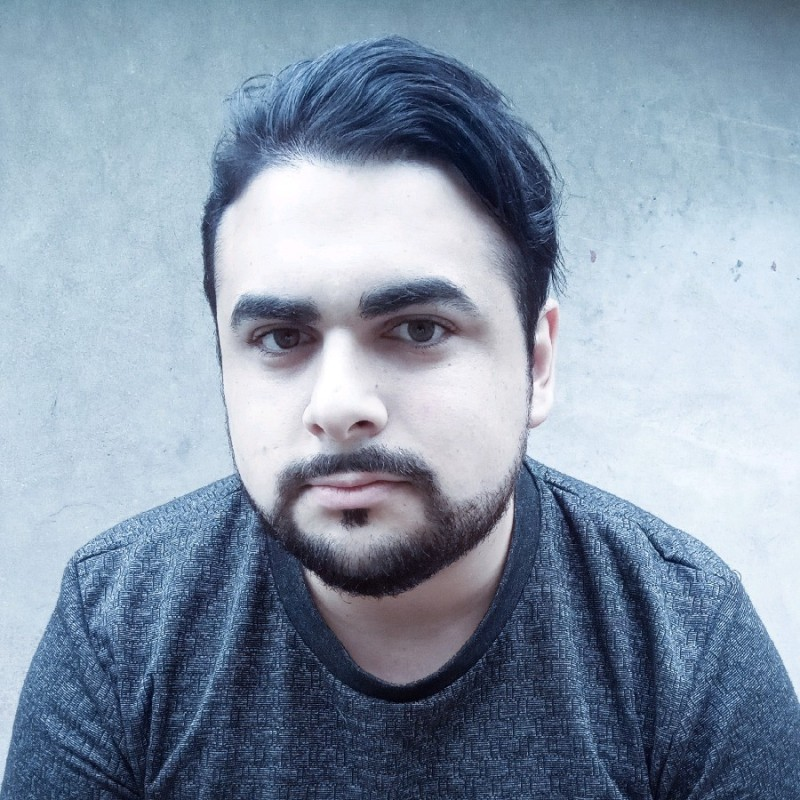
    <figcaption class="md-typeset">Marcelo Álvarez</figcaption>
  </figure>

<figure class="mdx-users__testimonial black-and-white">
    
    <figcaption class="md-typeset">Timur Dogan</figcaption>
  </figure>

## 👥 Advisors & Alumni 

<figure class="mdx-users__testimonial black-and-white">
    
    <figcaption class="md-typeset">Tobias Holzmann</figcaption>
  </figure>
 
<figure class="mdx-users__testimonial black-and-white">
    
    <figcaption class="md-typeset">Remy Mermelstein</figcaption>
  </figure>

<figure class="mdx-users__testimonial black-and-white">
    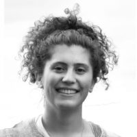
    <figcaption class="md-typeset">Zoe De Simone</figcaption>
  </figure>

---

{width="350" .skip-lightbox align=left loading=lazy}
{width="320" .skip-lightbox align=right loading=lazy}

:octicons-plus-24:

   

Eddy3D is being developed as a cross-disciplinary project through a collaboration between the Georgia Tech School of Architecture, the Environmental Systems Lab at Cornell AAP, and the Systems Engineering department at Cornell Engineering.

---

## 🎉 Supporters

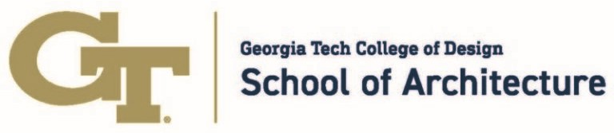{width="250" .skip-lightbox loading=lazy .center}
{ .card }

{width="250" .skip-lightbox loading=lazy .center}
{ .card }

{width="75" .skip-lightbox loading=lazy .center}
{ .card }

{width="75" .skip-lightbox loading=lazy .center}
{ .card }

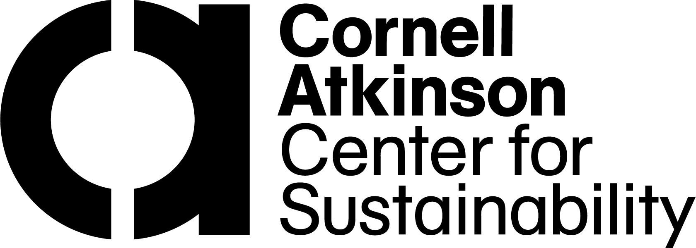{width="200" .skip-lightbox loading=lazy .center}
{ .card }

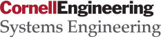{width="250" .skip-lightbox loading=lazy .center}
{ .card }

