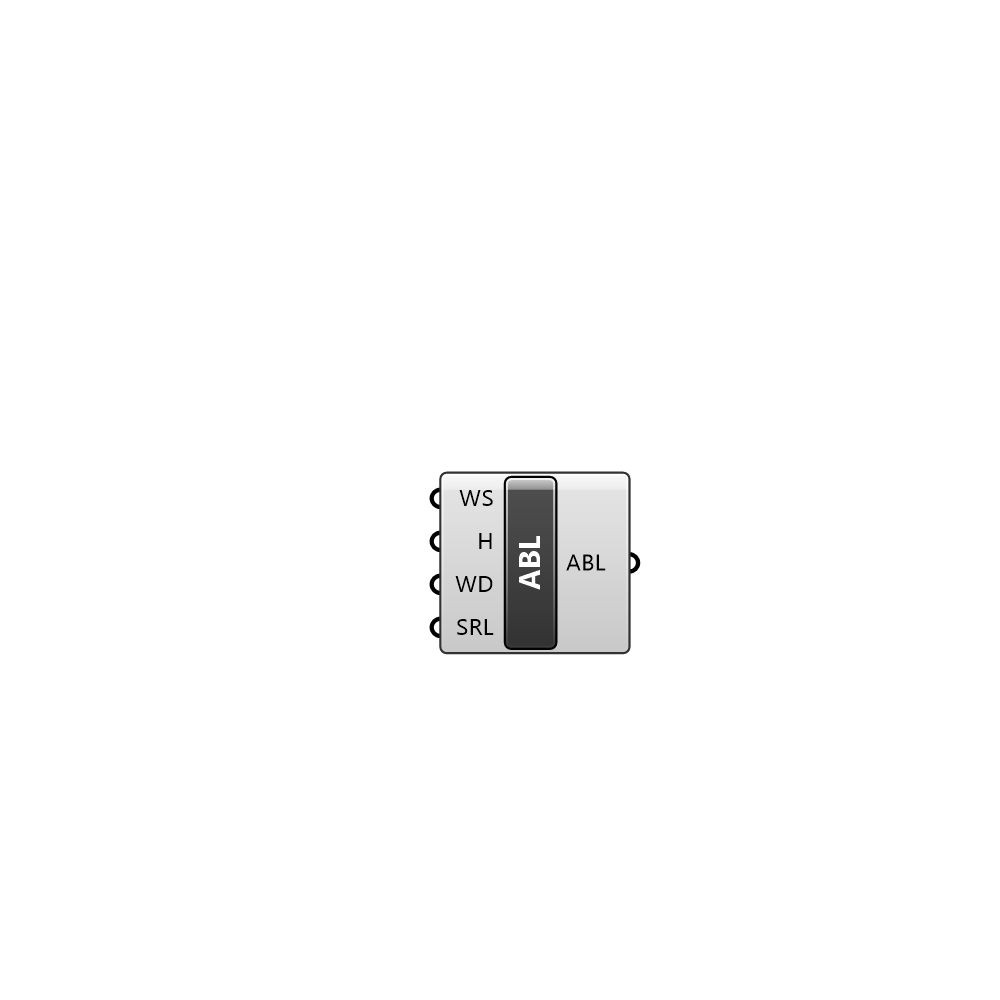

##  ABL Condition - [[source code]](C:\Users\pkastner\Documents\GitHub\Eddy3D\UMCF/ABL%20Condition.py)

Atmospheric Boundary Layer condition for air region

#### Inputs
* ##### WS []
Wind speed at the given Height
* ##### H []
Heigh at which windspeed is given
* ##### WD []
Wind direction
* ##### SRL []
Surface roughness length

#### Outputs
* ##### ABL
Atmospheric Boundary Layer settings

[Check Hydra Example Files for ABL Condition](https://hydrashare.github.io/hydra/index.html?keywords=ABL Condition)