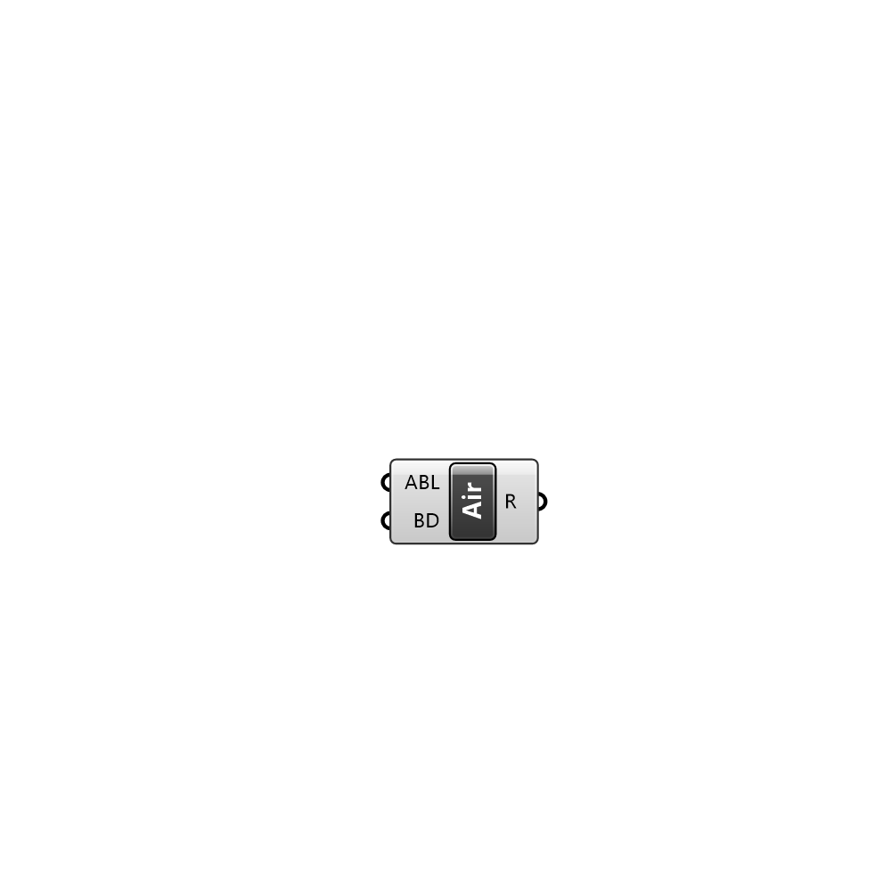

##  Air Region - [[source code]](C:\Users\pkastner\Documents\GitHub\Eddy3D\UMCF/Air%20Region.py)

Air region

#### Inputs
* ##### ABL []
Atmospheric boundary layer condition setting
* ##### BD []
List of parameters of the box domain in the order: front, 

#### Outputs
* ##### R
Air region.

[Check Hydra Example Files for Air Region](https://hydrashare.github.io/hydra/index.html?keywords=Air Region)