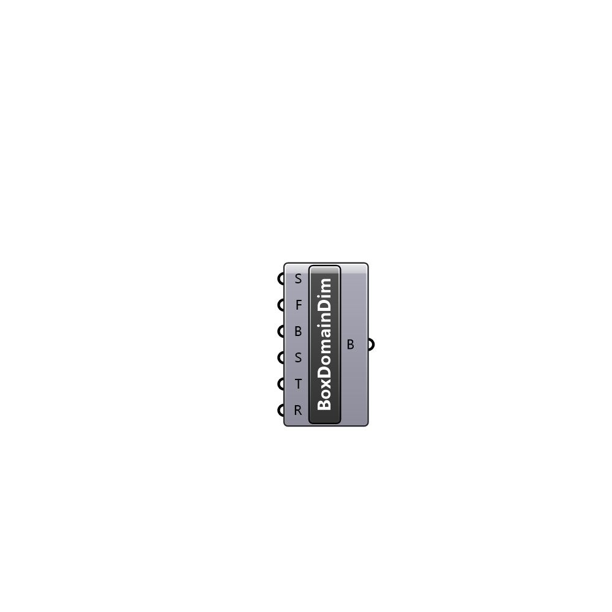

##  Box Domain Dimensions - [[source code]](C:\Users\pkastner\Documents\GitHub\Eddy3D\UMCF/Box%20Domain%20Dimensions.py)

Parameters for box domain dimensions

#### Inputs
* ##### S []
Size of the cell in every direction of the box
* ##### F []
Additional extension of box domain towards the front face, starting from the bounding box of all geometry.
* ##### B []
Additional extension of box domain towards the back face, starting from the bounding box of all geometry.
* ##### S []
Additional extension of box domain towards the side faces, starting from the bounding box of all geometry.
* ##### T []
Additional extension of box domain towards the top face, starting from the bounding box of all geometry.
* ##### R []
Additional extension of refinement box towards every face, starting from the bounding box of all geometry.

#### Outputs
* ##### B
Box domain parameters as a list.

[Check Hydra Example Files for Box Domain Dimensions](https://hydrashare.github.io/hydra/index.html?keywords=Box Domain Dimensions)