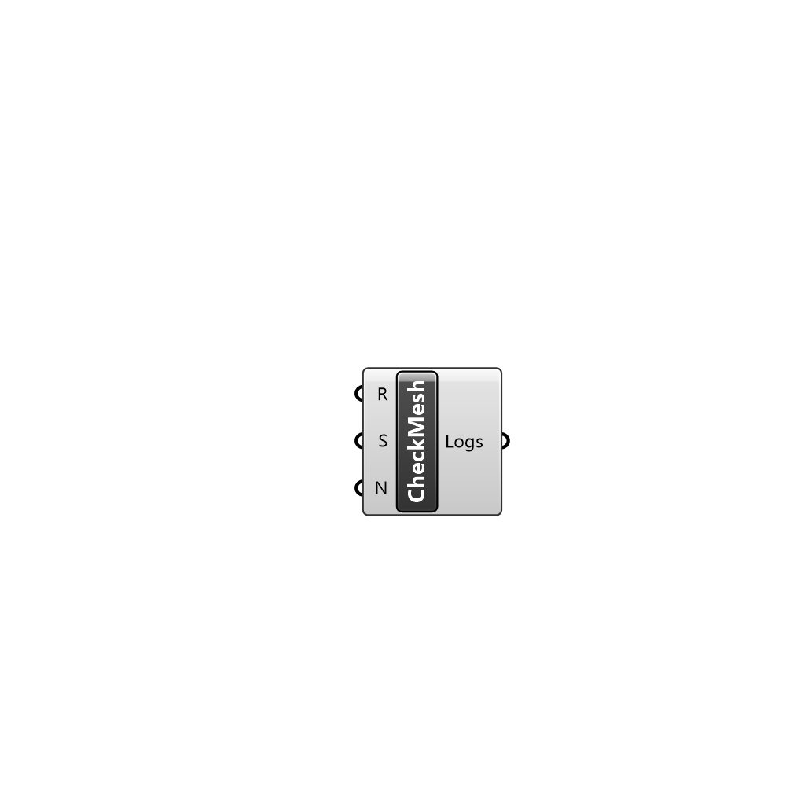

##  CheckMesh - [[source code]](C:\Users\pkastner\Documents\GitHub\Eddy3D\UMCF/CheckMesh.py)

Runs the checkMesh command in OpenFOAM

#### Inputs
* ##### R []
Set to true to run the checkMesh command
* ##### S []
Simulator instance with access to the case to check
* ##### N []
Name of the region to check

#### Outputs
* ##### Logs
Logs generated by the checkMesh command

[Check Hydra Example Files for CheckMesh](https://hydrashare.github.io/hydra/index.html?keywords=CheckMesh)