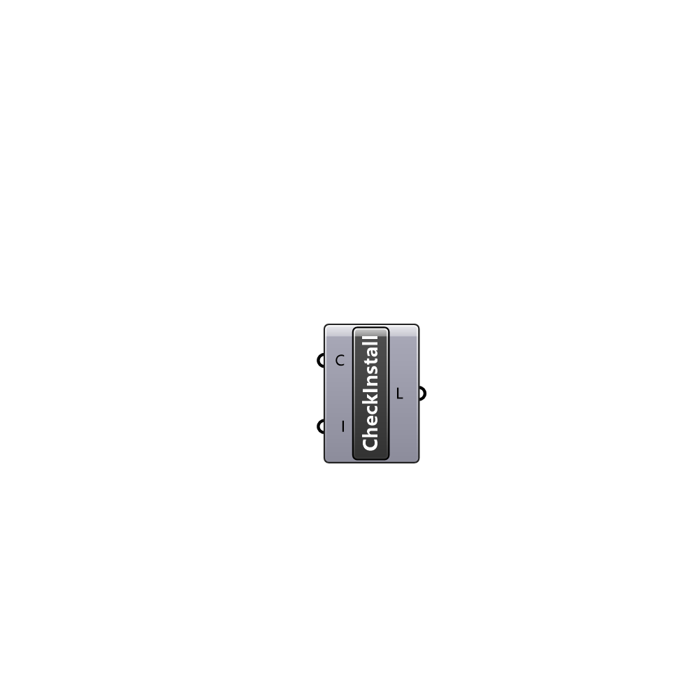

##  Check Installation - [[source code]](https://github.com/Eddy3D-Dev/Eddy3D/tree/dev/Check%20Installation.cs)

Checks installation

#### Input
* ##### C 
Set to true to check if dependendies were installed correctly
* ##### I 
Set to true to install urbanMicroclimateFoam

#### Output
* ##### L
Logs of the installation check