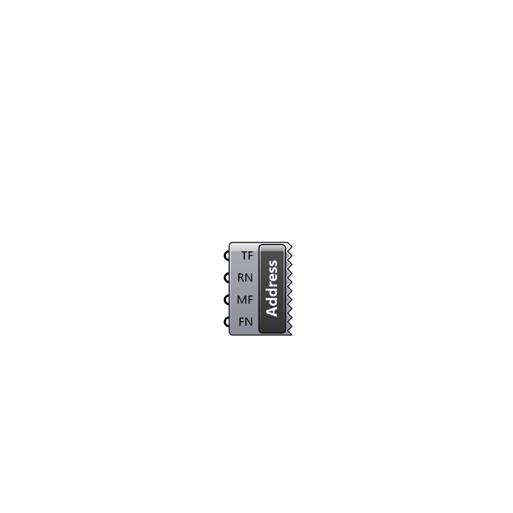

##  Create Address - [[source code]](C:\Users\pkastner\Documents\GitHub\Eddy3D\UMCF/Create%20Address.py)

Creates an Address for a Key

#### Inputs
* ##### TF []
0 = root; 1 = system; 2 = constant; 3 = zero
* ##### RN []
Name of the region
* ##### MF []
Optional middle folders between region and file
* ##### FN []
Name of the file

#### Outputs

[Check Hydra Example Files for Create Address](https://hydrashare.github.io/hydra/index.html?keywords=Create Address)