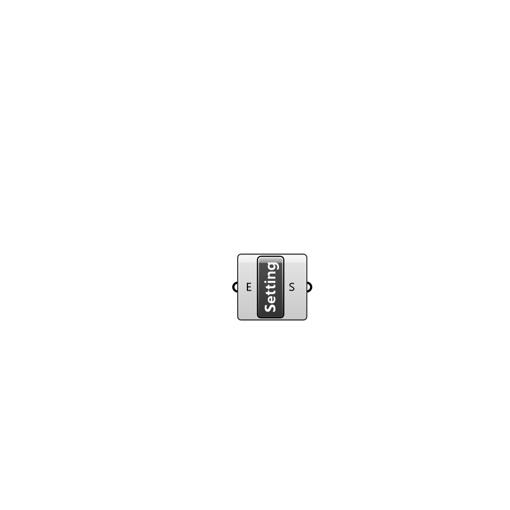

##  Create Setting - [[source code]](C:\Users\pkastner\Documents\GitHub\Eddy3D\UMCF/Create%20Setting.py)

Creates a custom Setting instance. Settings contain a list of entries.

#### Inputs
* ##### E []
Entries to be added to the Setting.

#### Outputs
* ##### S
The created Setting instance.

[Check Hydra Example Files for Create Setting](https://hydrashare.github.io/hydra/index.html?keywords=Create Setting)