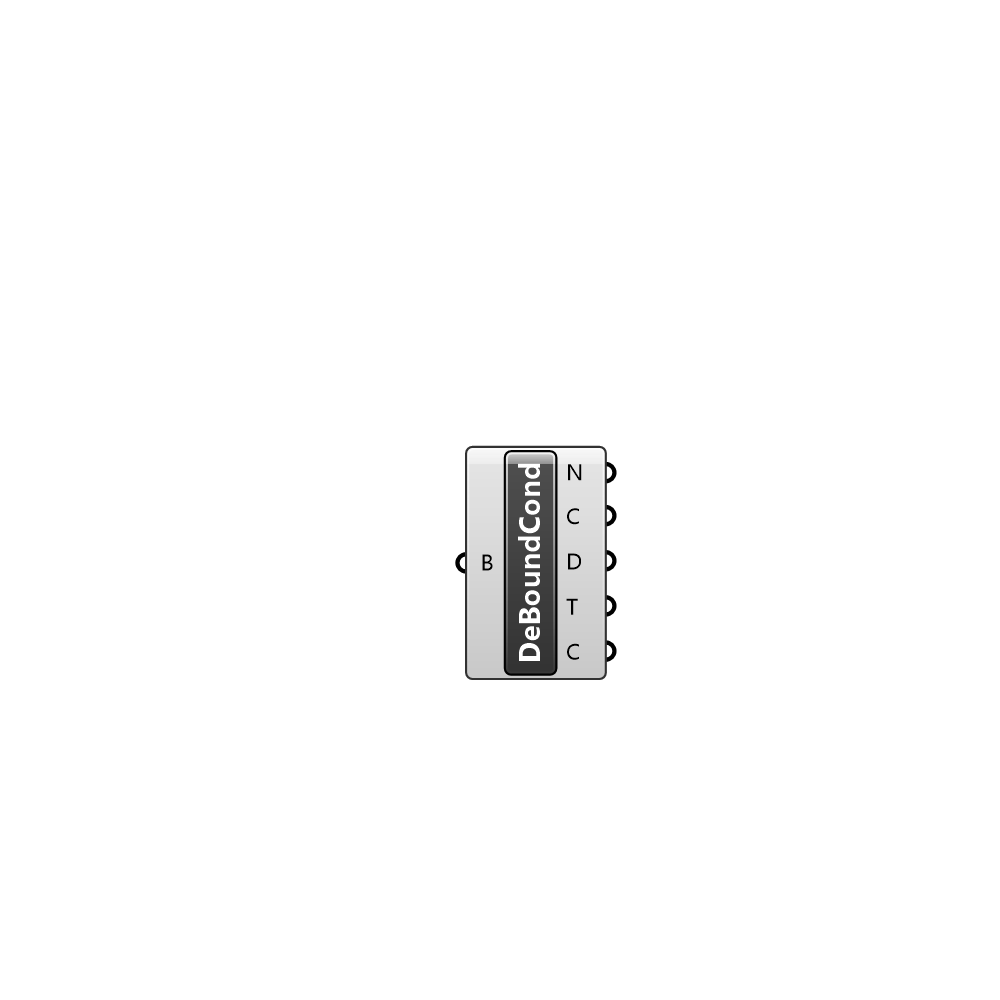

##  Deconstruct Boundary Condition - [[source code]](C:\Users\pkastner\Documents\GitHub\Eddy3D\UMCF/Deconstruct%20Boundary%20Condition.py)

Deconstrunct a boundary condition instance.

#### Inputs
* ##### B []
Boundary condition to deconstruct.

#### Outputs
* ##### N
Name.
* ##### C
Class.
* ##### D
Description.
* ##### T
Type.
* ##### C
Content.

[Check Hydra Example Files for Deconstruct Boundary Condition](https://hydrashare.github.io/hydra/index.html?keywords=Deconstruct Boundary Condition)