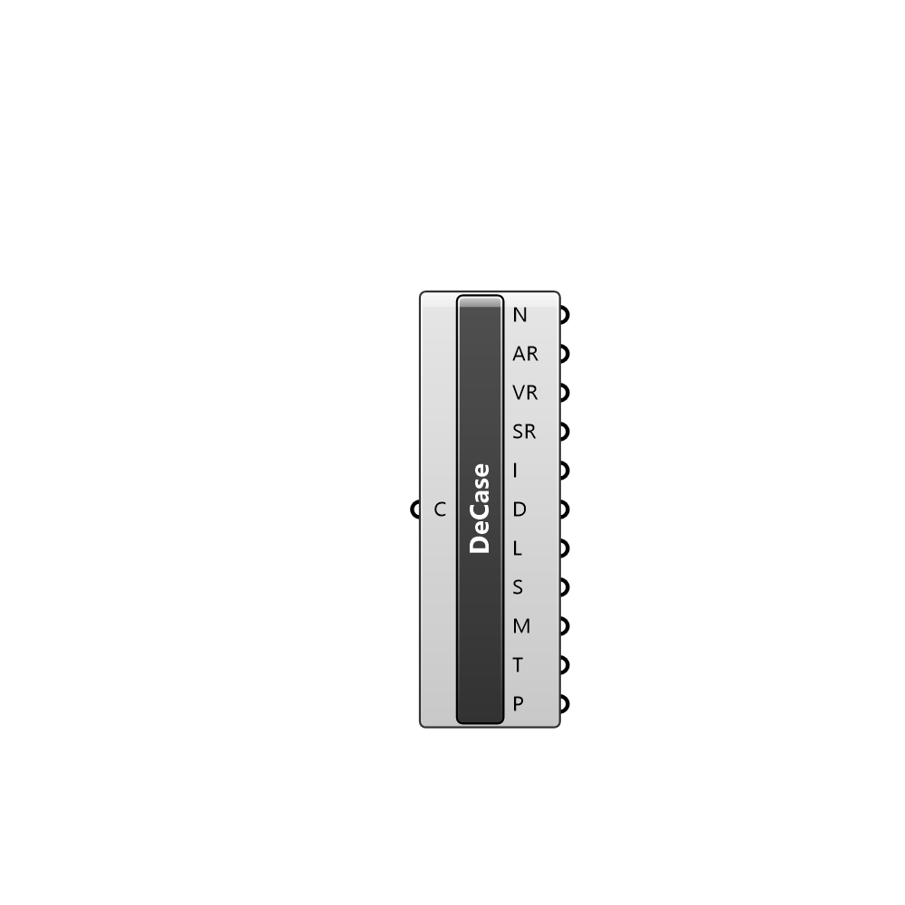

##  Deconstruct Case - [[source code]](C:\Users\pkastner\Documents\GitHub\Eddy3D\UMCF/Deconstruct%20Case.py)

Deconstructs a Case instance, exposing all types of file containers.

#### Inputs
* ##### C []
Case to deconstruct.

#### Outputs
* ##### N
Case name.
* ##### AR
Air region in the case
* ##### VR
Vegetation regions in the case
* ##### SR
Solid regions in the case
* ##### I
OpenFOAM initial condition dictionaries found in the directory, stored in file containers.
* ##### D
OpenFOAM dictionaries found in the directory, stored in file containers.
* ##### L
OpenFOAM lists found in the directory, stored in file containers.
* ##### S
Scripts found in the directory, stored in file containers.
* ##### M
Meshes found in the directory, stored in mesh containers.
* ##### T
Files that do not meet other categories.
* ##### P
Name of the patches found in the case initial conditions.

[Check Hydra Example Files for Deconstruct Case](https://hydrashare.github.io/hydra/index.html?keywords=Deconstruct Case)