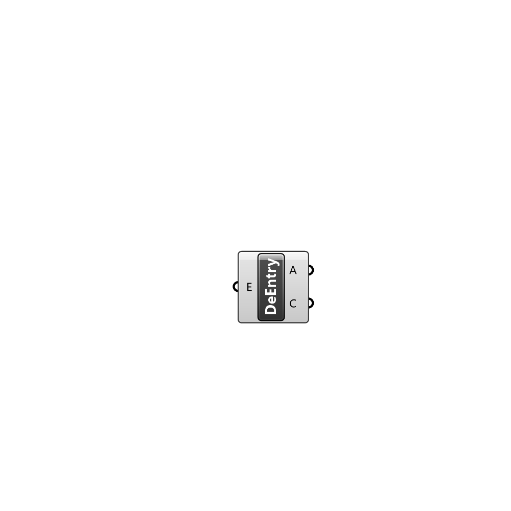

##  Deconstruct Entry - [[source code]](C:\Users\pkastner\Documents\GitHub\Eddy3D\UMCF/Deconstruct%20Entry.py)

Deconstructs an Entry instance.

#### Inputs
* ##### E []
Entry to deconstruct.

#### Outputs
* ##### A
Entry address.
* ##### C
Conent of the entry as key value pairs.

[Check Hydra Example Files for Deconstruct Entry](https://hydrashare.github.io/hydra/index.html?keywords=Deconstruct Entry)