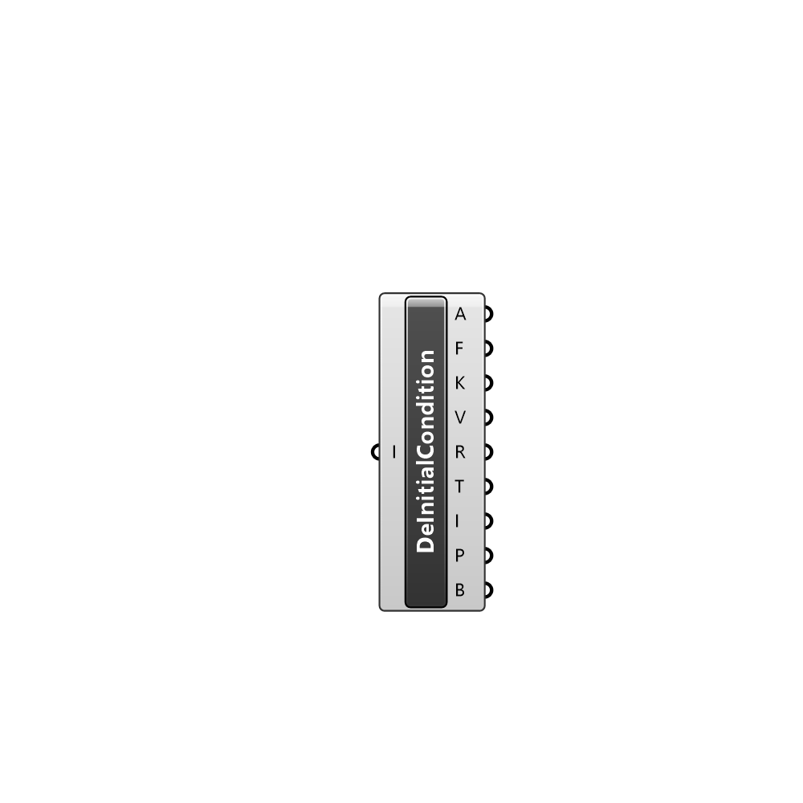

##  Deconstruct Initial Condition - [[source code]](C:\Users\pkastner\Documents\GitHub\Eddy3D\UMCF/Deconstruct%20Initial%20Condition.py)

Deconstructs an initial condition

#### Inputs
* ##### I []
File container of type InitialCondition to deconstruct.

#### Outputs
* ##### A
File container Address
* ##### F
File container file type
* ##### K
File container keys
* ##### V
File container values
* ##### R
Raw content of the file
* ##### T
Type of initial condition
* ##### I
Internal field value
* ##### P
Name of patches addressed by initial condition
* ##### B
Boundary conditions for each patch

[Check Hydra Example Files for Deconstruct Initial Condition](https://hydrashare.github.io/hydra/index.html?keywords=Deconstruct Initial Condition)