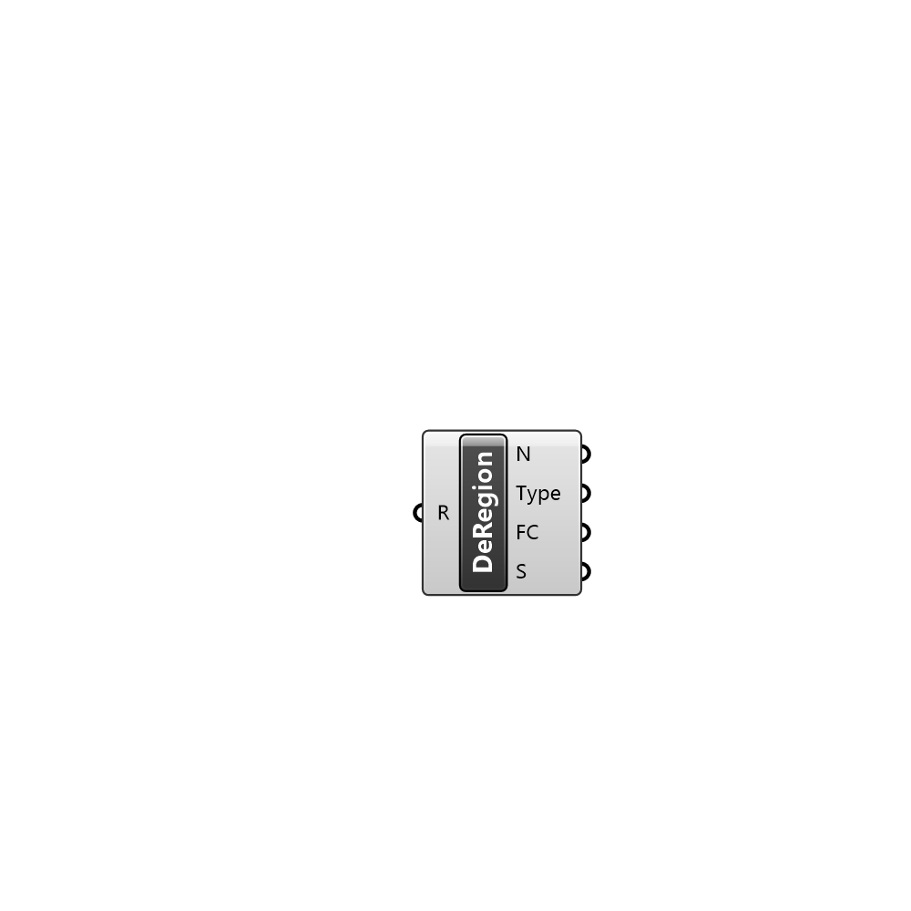

##  Deconstruct Region - [[source code]](C:\Users\pkastner\Documents\GitHub\Eddy3D\UMCF/Deconstruct%20Region.py)

Deconstructs a Region

#### Inputs
* ##### R []
Region to deconstruct

#### Outputs
* ##### N
Name of the region
* ##### Type
Type of the region
* ##### FC
File Containers in the region
* ##### S
Setting in the region

[Check Hydra Example Files for Deconstruct Region](https://hydrashare.github.io/hydra/index.html?keywords=Deconstruct Region)