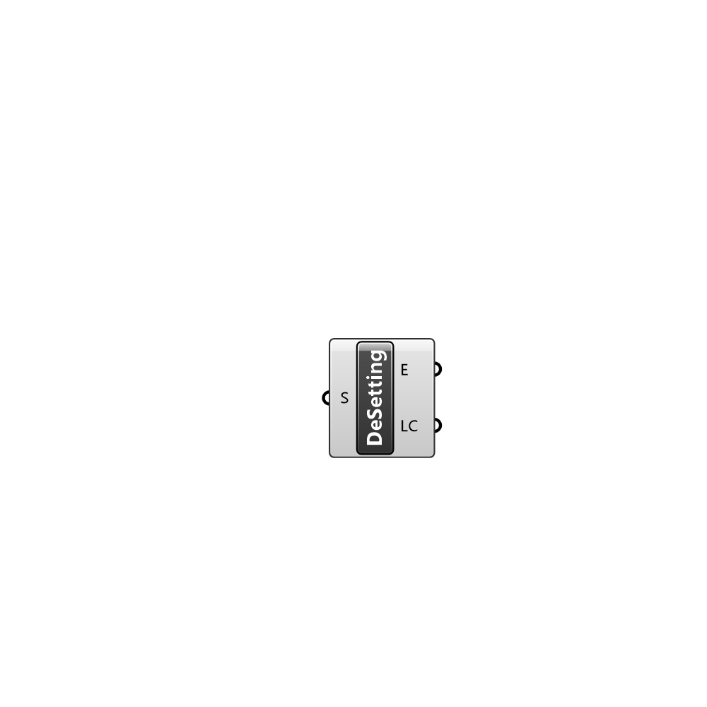

##  Deconstruct Setting - [[source code]](C:\Users\pkastner\Documents\GitHub\Eddy3D\UMCF/Deconstruct%20Setting.py)

Deconstrusct a setting instance.

#### Inputs
* ##### S []
Setting to deconstruct

#### Outputs
* ##### E
Entries in the setting.
* ##### LC
List containers in the setting

[Check Hydra Example Files for Deconstruct Setting](https://hydrashare.github.io/hydra/index.html?keywords=Deconstruct Setting)