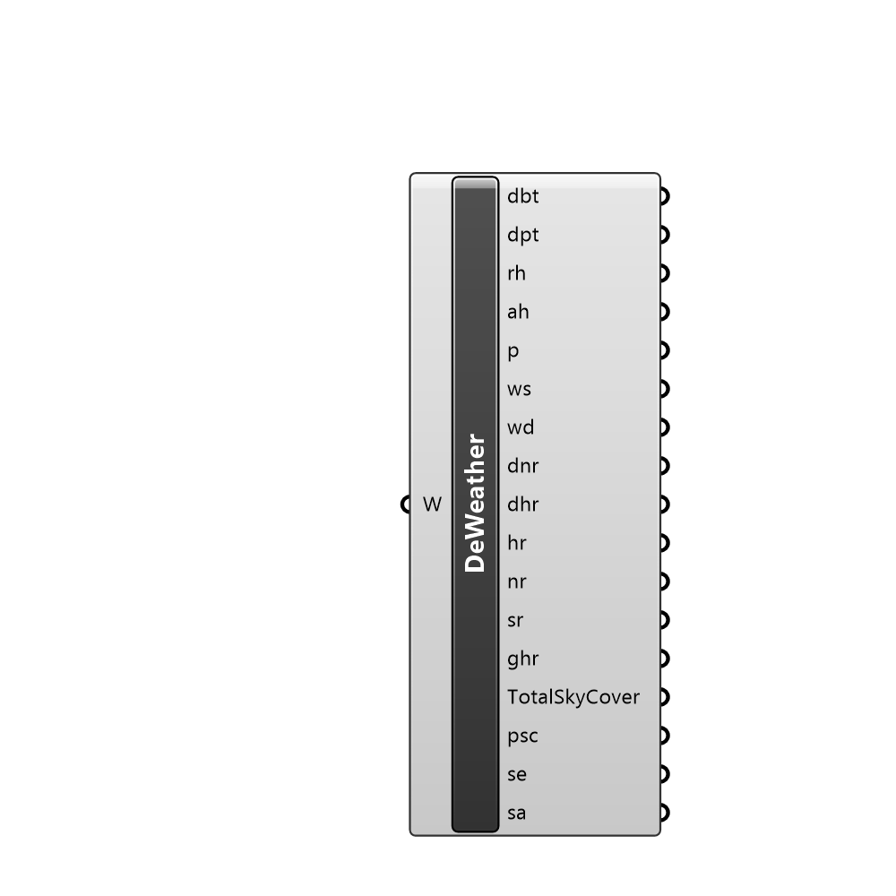

##  Deconstruct Weather - [[source code]](C:\Users\pkastner\Documents\GitHub\Eddy3D\UMCF/Deconstruct%20Weather.py)

Deconstructs a Weather instance, exposing the weather information.

#### Inputs
* ##### W []
Weather instance

#### Outputs
* ##### dbt
DryBulbTemp
* ##### dpt
DewPointTemp
* ##### rh
RelativeHumidity
* ##### p
Pressure
* ##### ws
WindSpeed
* ##### wd
WindDirection
* ##### dnr
DirectNormalRadiation
* ##### dhr
DiffuseHorizontalRadiation
* ##### hr
HorRadiation
* ##### nr
NormalRadiation
* ##### sr
SkyRadiation
* ##### ghr
GHorRadiation
* ##### TotalSkyCover
tsc
* ##### psc
OpaqSkyCover
* ##### se
SolarElevation
* ##### sa
SolarAzi

[Check Hydra Example Files for Deconstruct Weather](https://hydrashare.github.io/hydra/index.html?keywords=Deconstruct Weather)