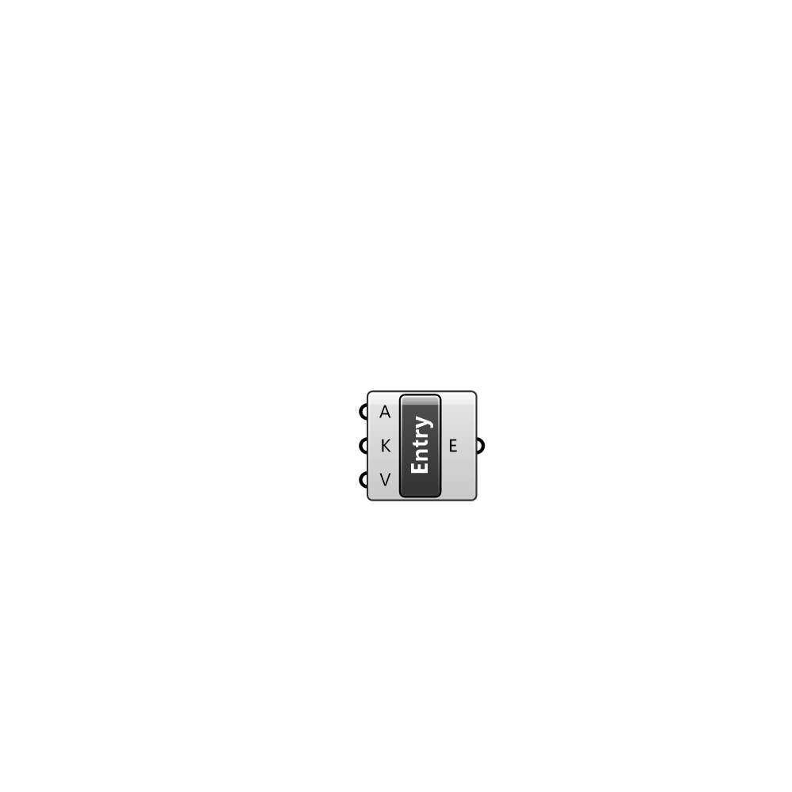

##  Entry from a Key and Value - [[source code]](C:\Users\pkastner\Documents\GitHub\Eddy3D\UMCF/Entry%20from%20a%20Key%20and%20Value.py)

Description

#### Inputs
* ##### A []
Address where the entry will modify or add content.
* ##### K []
Entry keys.
* ##### V []
Entry values keys.

#### Outputs
* ##### E
The created entry.

[Check Hydra Example Files for Entry from a Key and Value](https://hydrashare.github.io/hydra/index.html?keywords=Entry from a Key and Value)