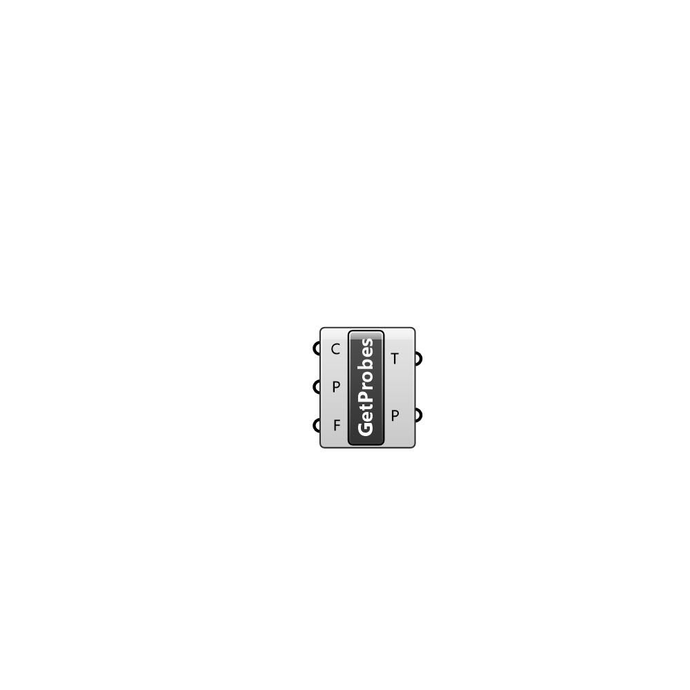

##  Get Probes - [[source code]](C:\Users\pkastner\Documents\GitHub\Eddy3D\UMCF/Get%20Probes.py)

Get probe values from a field

#### Inputs
* ##### C []
Case
* ##### P []
Name of the probing to get information from
* ##### F []
Field to retrieve from probes

#### Outputs
* ##### T
Simulation time steps
* ##### P
Probe values

[Check Hydra Example Files for Get Probes](https://hydrashare.github.io/hydra/index.html?keywords=Get Probes)