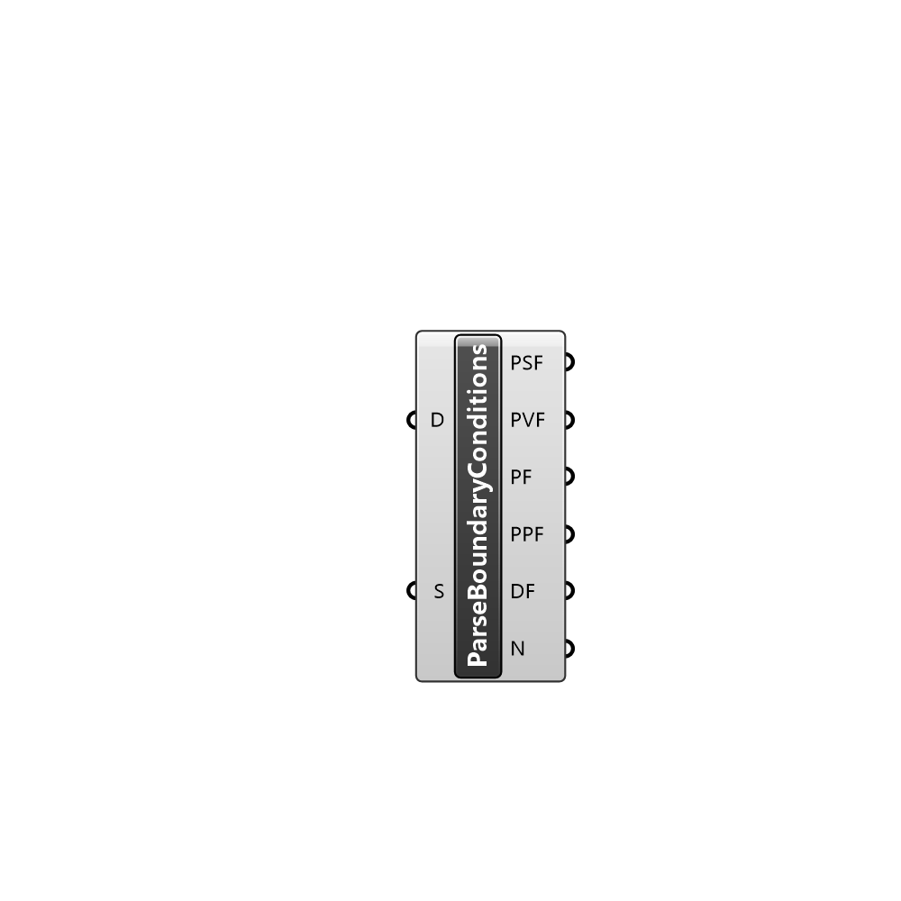

##  Parse OF Headers - [[source code]](C:\Users\pkastner\Documents\GitHub\Eddy3D\UMCF/Parse%20OF%20Headers.py)

Parses a directory looking for boundary conditions.

#### Inputs
* ##### D []
Directory
* ##### S []
List of boundary conditions to select. If no list is provided, all boundary conditions are selected.

#### Outputs
* ##### PSF
Boundary conditions of type FvPatchScalarField found, and that exist in the selection input.
* ##### PVF
Boundary conditions of type FvPatchVectorField found, and that exist in the selection input.
* ##### PF
Boundary conditions of type FvPatchFields found, and that exist in the selection input.
* ##### PPF
Boundary conditions of type PointPatchFields found, and that exist in the selection input.
* ##### DF
Boundary conditions of tpye DimensionedFields found, and that exist in the selection input.
* ##### N
Names of all boundary conditions found.

[Check Hydra Example Files for Parse OF Headers](https://hydrashare.github.io/hydra/index.html?keywords=Parse OF Headers)