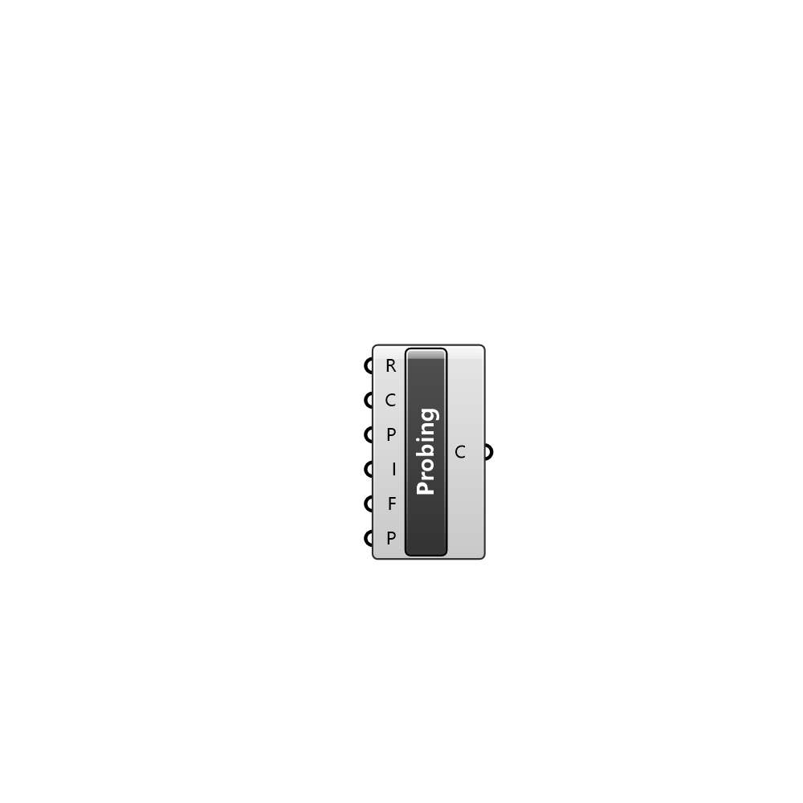

##  Probing - [[source code]](C:\Users\pkastner\Documents\GitHub\Eddy3D\UMCF/Probing.py)

Probes the simulation

#### Inputs
* ##### R []
Set to true to run the probing
* ##### C []
Case to probe
* ##### P []
Name of this probing
* ##### I []
Probing interpolation scheme. 0 =  cell; 1 =  cellPoint; 2 = cellPointFace; 3 = pointMVC; 4 = cellPatchConstrained
* ##### F []
Fields to probe. T = air temperature; Tl = Tl; U = wind velocity; alphat = turbulent thermal diffusivity; epsilon = turbulent dissipation rate; k = turbulent kinetic energy; nut = turbulent diffusivity; p = pressure; p_rgh = modified pressure without hydrostatic effects; rho = rho; rs = rs; w = humidity ratio
* ##### P []
Points to probe the simulation

#### Outputs
* ##### C
Probed case. Use GetProbes component to retrieve probe data

[Check Hydra Example Files for Probing](https://hydrashare.github.io/hydra/index.html?keywords=Probing)