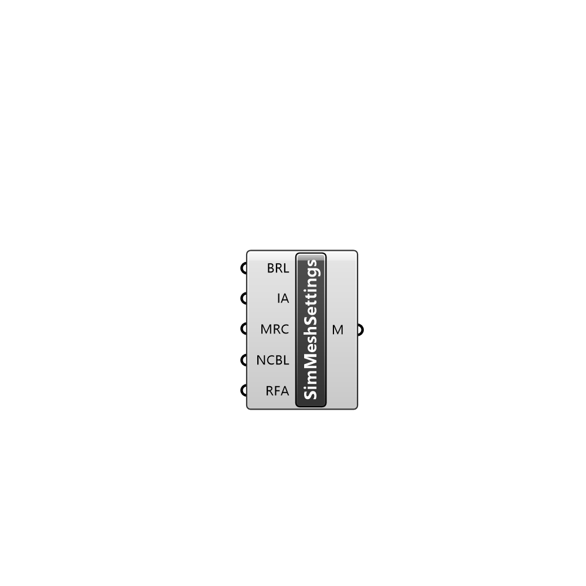

##  Simulation MeshSettings - [[source code]](C:\Users\pkastner\Documents\GitHub\Eddy3D\UMCF/Simulation%20MeshSettings.py)

Simulation mesh settings.

#### Inputs
* ##### BRL []
Refinement level inside refinement box
* ##### IA []
Identify a feature when angle between faces < includedAngle
* ##### MRC []
Minimum refinement of cells
* ##### NCBL []
Number of cells between levels
* ##### RFA []
Resolve feature angle

#### Outputs
* ##### M
Simulation mesh settings.

[Check Hydra Example Files for Simulation MeshSettings](https://hydrashare.github.io/hydra/index.html?keywords=Simulation MeshSettings)