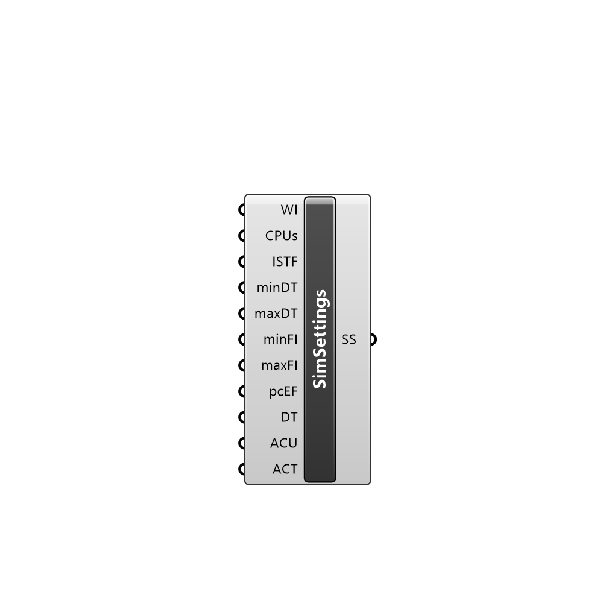

##  Simulation Settings - [[source code]](C:\Users\pkastner\Documents\GitHub\Eddy3D\UMCF/Simulation%20Settings.py)

Simulation settings.

#### Inputs
* ##### WI []
Write interval
* ##### CPUs []
Number of CPUs to be used
* ##### ISTF []
urbanMicroclimateFoam controls: Initial Solid Timestep Factor
* ##### minDT []
urbanMicroclimateFoam controls: Minimum time between iterations
* ##### maxDT []
urbanMicroclimateFoam controls: Maximum time between iterations
* ##### minFI []
urbanMicroclimateFoam controls: maxFluidIteration
* ##### maxFI []
urbanMicroclimateFoam controls: maxFluidIteration
* ##### pcEF []
'pc-based' or 'mixed' - default is 'pc-based'
* ##### DT []
blendingCoeffs: Damping thickness
* ##### ACU []
blendingCoeffs: alphaCoeffU
* ##### ACT []
blendingCoeffs: alphaCoeffT

#### Outputs
* ##### SS
Simulation settings

[Check Hydra Example Files for Simulation Settings](https://hydrashare.github.io/hydra/index.html?keywords=Simulation Settings)