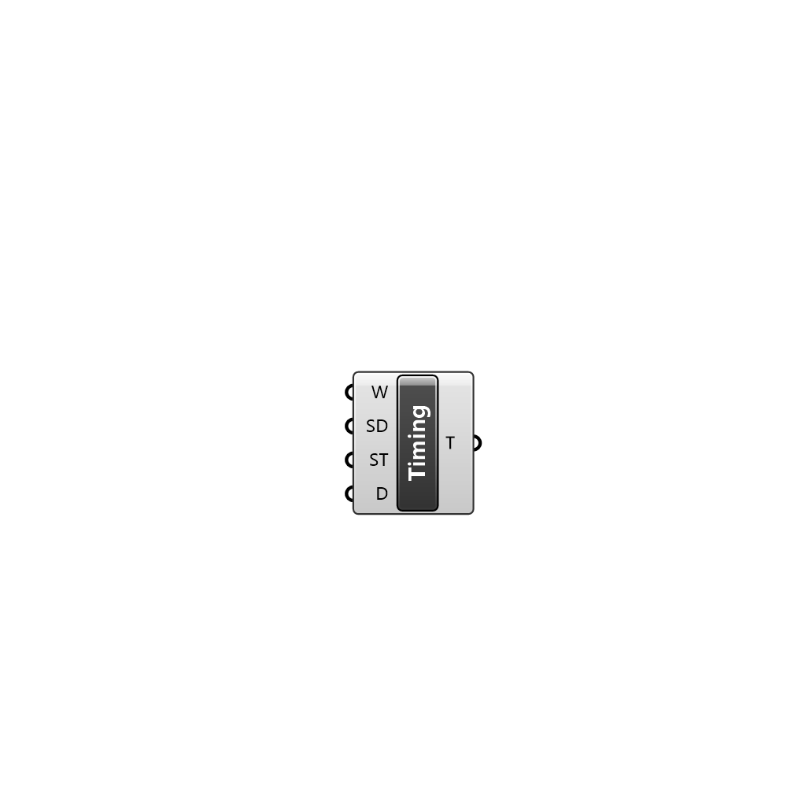

##  Timing Parameters - [[source code]](C:\Users\pkastner\Documents\GitHub\Eddy3D\UMCF/Timing%20Parameters.py)

Timing parameters of the simulation

#### Inputs
* ##### W []
Weather instance.
* ##### RT []
Temperature inside the building. Values must match the duration of the simulation. One value per hour is required
* ##### SD []
Index of the day of the year to start the simulation on
* ##### ST []
Starting hour of the simulation
* ##### D []
Number of hours to simulate

#### Outputs
* ##### T
Simulation timing settings

[Check Hydra Example Files for Timing Parameters](https://hydrashare.github.io/hydra/index.html?keywords=Timing Parameters)