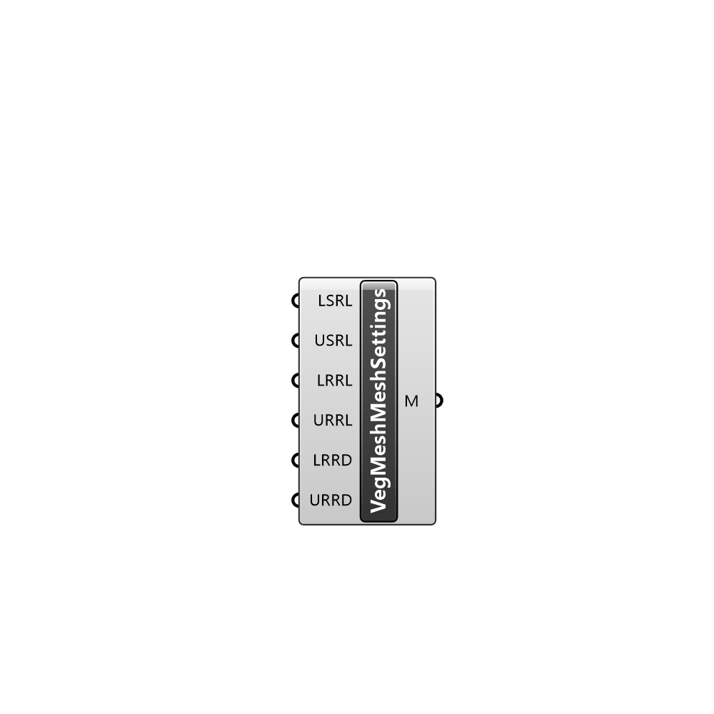

##  Vegetation Mesh Settings - [[source code]](C:\Users\pkastner\Documents\GitHub\Eddy3D\UMCF/Vegetation%20Mesh%20Settings.py)

Description

#### Inputs
* ##### FRL []
Feature refinement level
* ##### LSRL []
Lower value of surface refinement level
* ##### USRL []
Upper value of surface refinement level
* ##### LRRL []
Lower value of region refinement level
* ##### URRL []
Upper value of region refinement level
* ##### LRRD []
Lower distance to which apply region refinement level
* ##### URRD []
Upper distance to which apply region refinement level

#### Outputs
* ##### M
Vegetation mesh parameters

[Check Hydra Example Files for Vegetation Mesh Settings](https://hydrashare.github.io/hydra/index.html?keywords=Vegetation Mesh Settings)