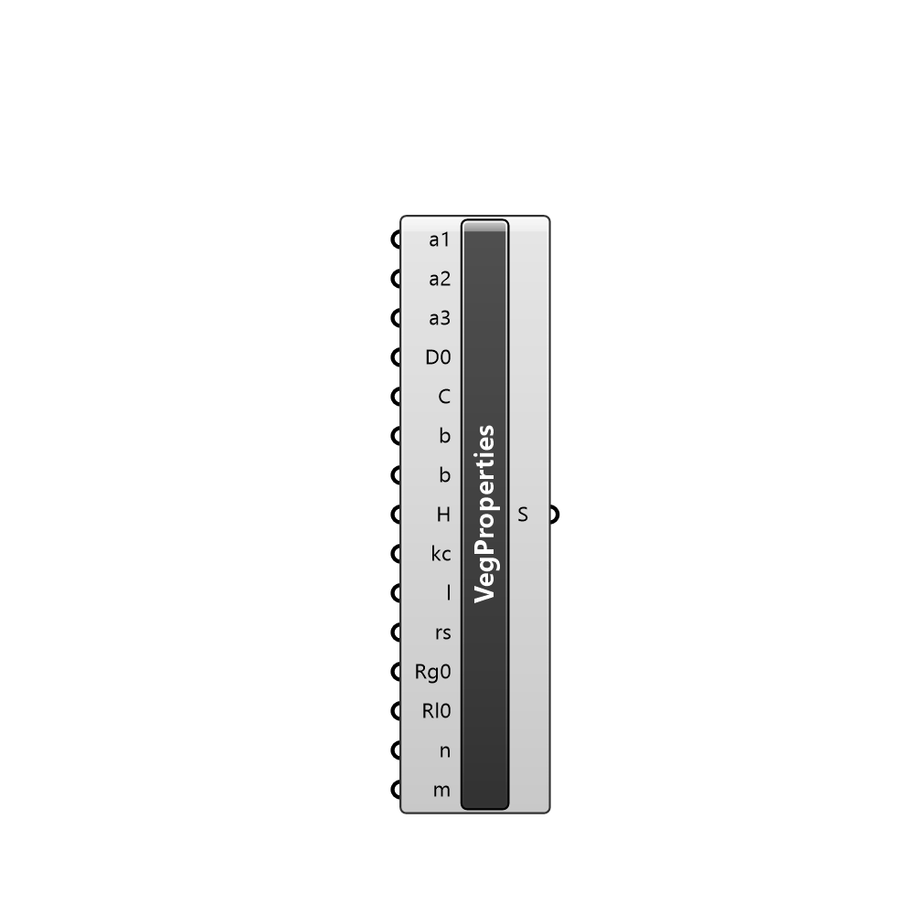

##  Vegetation Properties - [[source code]](C:\Users\pkastner\Documents\GitHub\Eddy3D\UMCF/Vegetation%20Properties.py)

Properties of vegetation.

#### Inputs
* ##### a1 []
stomatal resistance parameters
* ##### a2 []
stomatal resistance parameters
* ##### a3 []
stomatal resistance parameters
* ##### D0 []
stomatal resistance parameters
* ##### C []
proportionality factor
* ##### b []
turbulent production coeff
* ##### b []
turbulent destruction coeff
* ##### H []
location of canopy height
* ##### kc []
extinction coefficient of radiation
* ##### l []
characteristic length of leaf
* ##### rs []
stomatal resistance
* ##### Rg0 []
global radiation at top of canopy
* ##### Rl0 []
long-wave radiation at top of canopy
* ##### n []
nEvapSides
* ##### m []
minCellSizeFactor

#### Outputs
* ##### S
Vegetation properties as a Setting instance.

[Check Hydra Example Files for Vegetation Properties](https://hydrashare.github.io/hydra/index.html?keywords=Vegetation Properties)