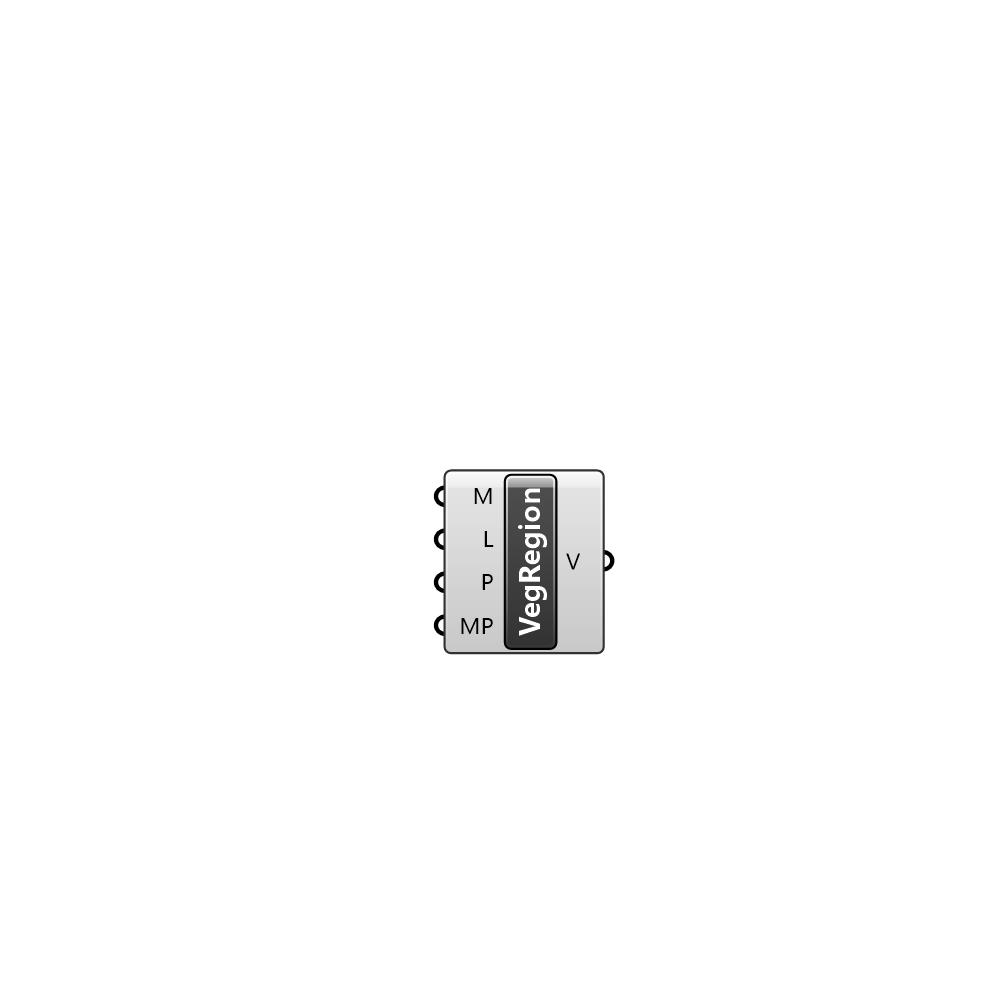

##  Vegetation Region - [[source code]](C:\Users\pkastner\Documents\GitHub\Eddy3D\UMCF/Vegetation%20Region.py)

Description

#### Inputs
* ##### M []
Vegetation mesh
* ##### L []
Leaf Area Density of the vegetation
* ##### P []
Vegetation properties
* ##### MP []
Mesh parameteres

#### Outputs
* ##### V
Vegetation region.

[Check Hydra Example Files for Vegetation Region](https://hydrashare.github.io/hydra/index.html?keywords=Vegetation Region)