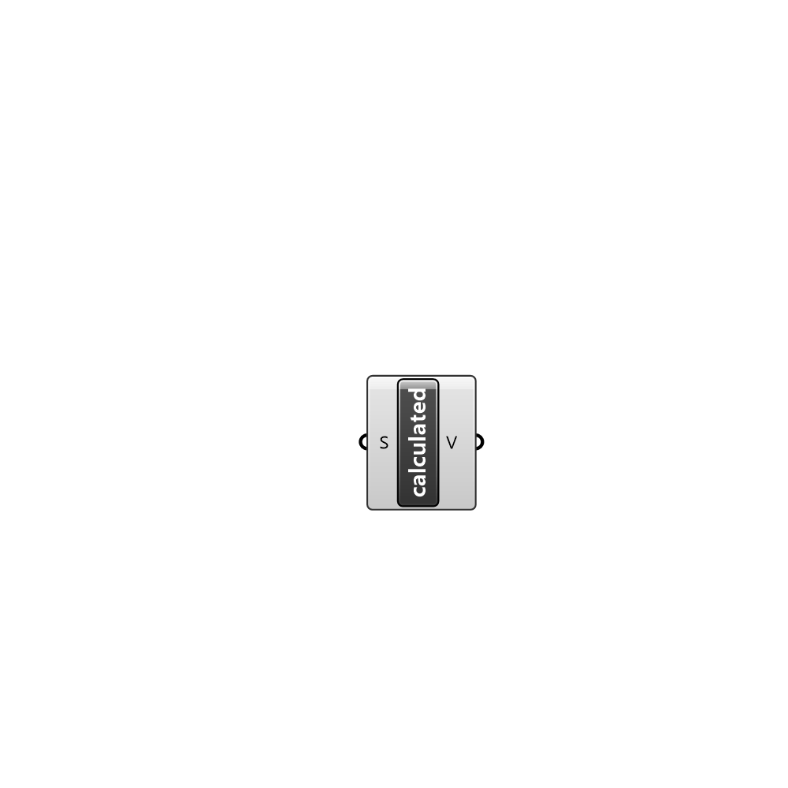

##  calculated - [[source code]](C:\Users\pkastner\Documents\GitHub\Eddy3D\UMCF/calculated.py)

calculated value

#### Inputs
* ##### S []
Scalar component of uniform value.

#### Outputs
* ##### V
The created calculated value instance.

[Check Hydra Example Files for calculated](https://hydrashare.github.io/hydra/index.html?keywords=calculated)