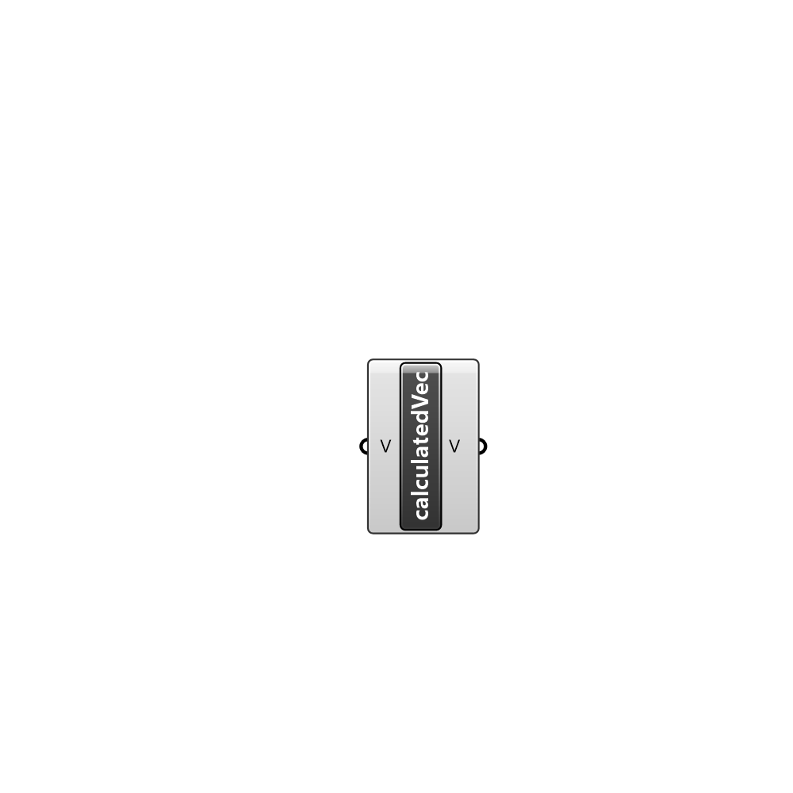

##  calculated Vector - [[source code]](C:\Users\pkastner\Documents\GitHub\Eddy3D\UMCF/calculated%20Vector.py)

calculated vector value

#### Inputs
* ##### V []
Vector

#### Outputs
* ##### V
The created calculated vector value instance.

[Check Hydra Example Files for calculated Vector](https://hydrashare.github.io/hydra/index.html?keywords=calculated Vector)