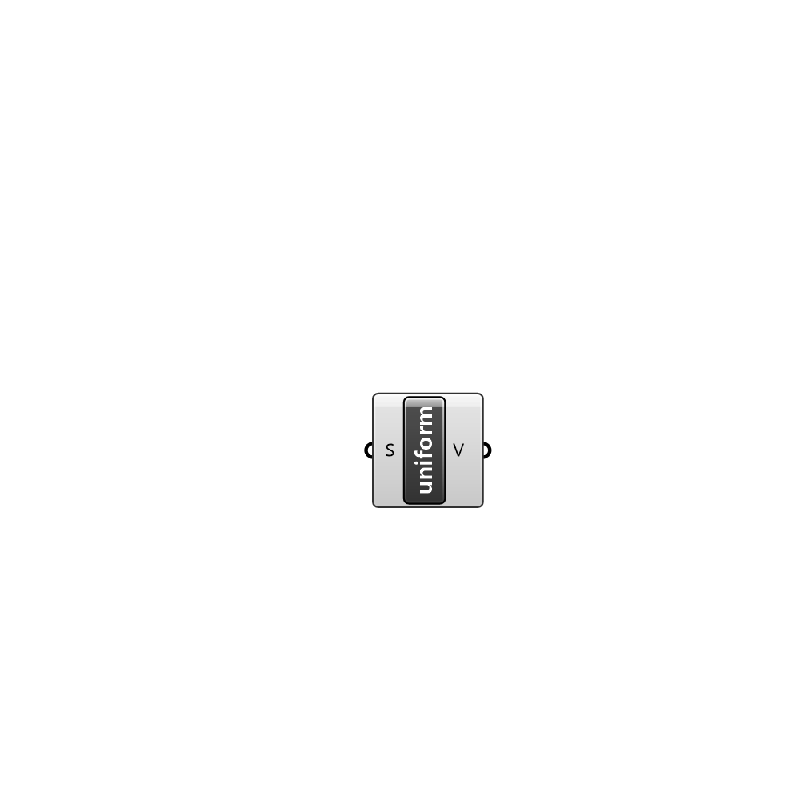

##  uniform - [[source code]](C:\Users\pkastner\Documents\GitHub\Eddy3D\UMCF/uniform.py)

uniform value

#### Inputs
* ##### S []
Scalar component of uniform value

#### Outputs
* ##### V
The created uniform value instance

[Check Hydra Example Files for uniform](https://hydrashare.github.io/hydra/index.html?keywords=uniform)