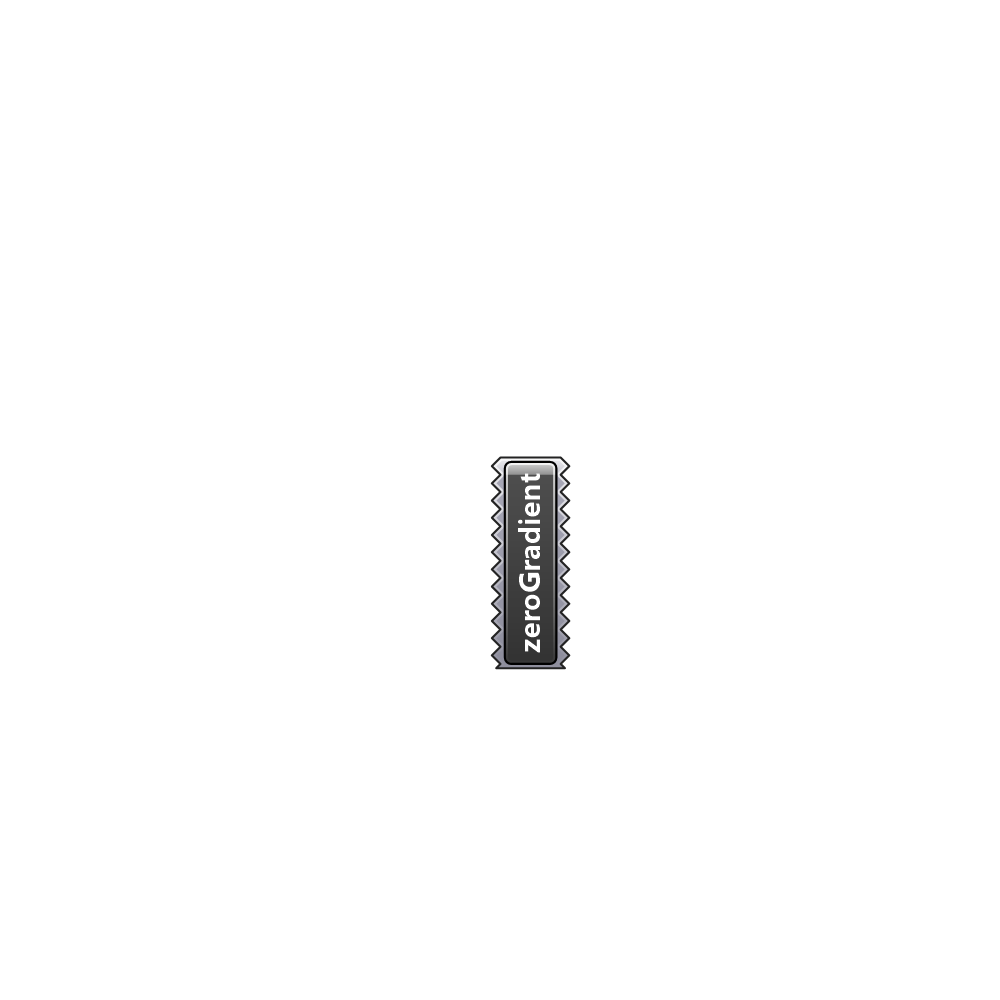

##  zeroGradient - [[source code]](C:\Users\pkastner\Documents\GitHub\Eddy3D\UMCF/zeroGradient.py)

zeroGradient value.

#### Inputs

#### Outputs

[Check Hydra Example Files for zeroGradient](https://hydrashare.github.io/hydra/index.html?keywords=zeroGradient)