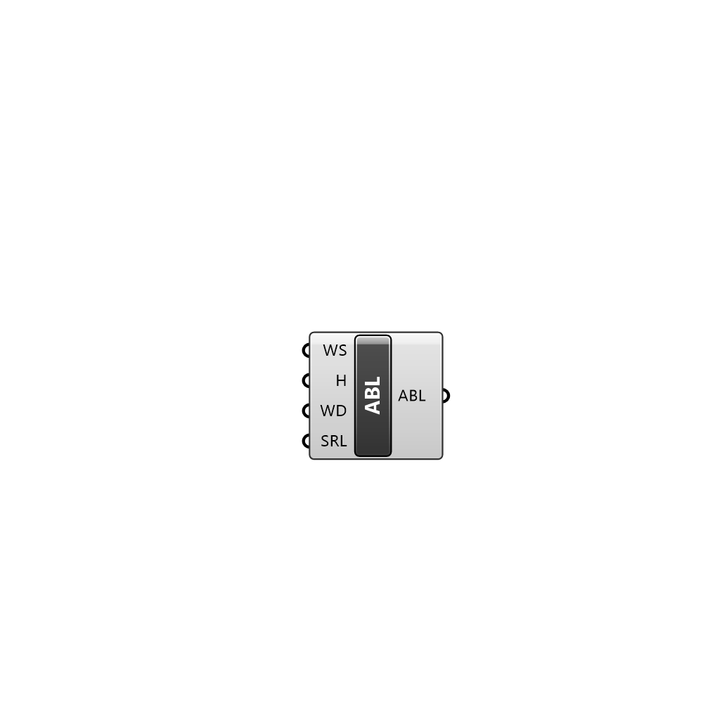

##  ABL Condition

Atmospheric Boundary Layer condition for air region

#### Input
* ##### WS 
Wind speed at the given Height
* ##### H 
Heigh at which windspeed is given
* ##### WD 
Wind direction
* ##### SRL 
Surface roughness length

#### Output
* ##### ABL
Atmospheric Boundary Layer settings