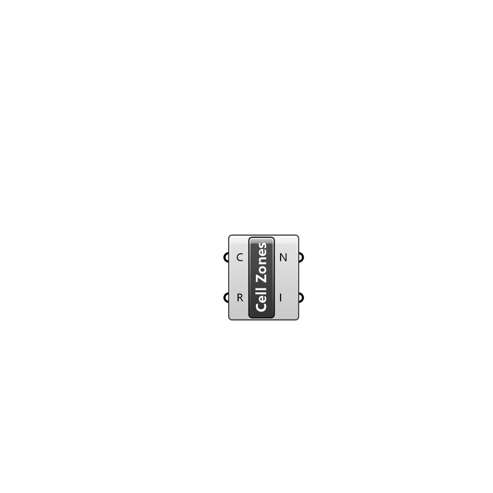

##  Cell Zones

Reads the cellZones.txt file to get cell zone names and their indices

#### Input
* ##### C 
UMCF Case class to extract the working directory
* ##### R 
UMCF Case region to visualize

#### Output
* ##### N
List of cell zone names
* ##### I
List of indices for each cell zone