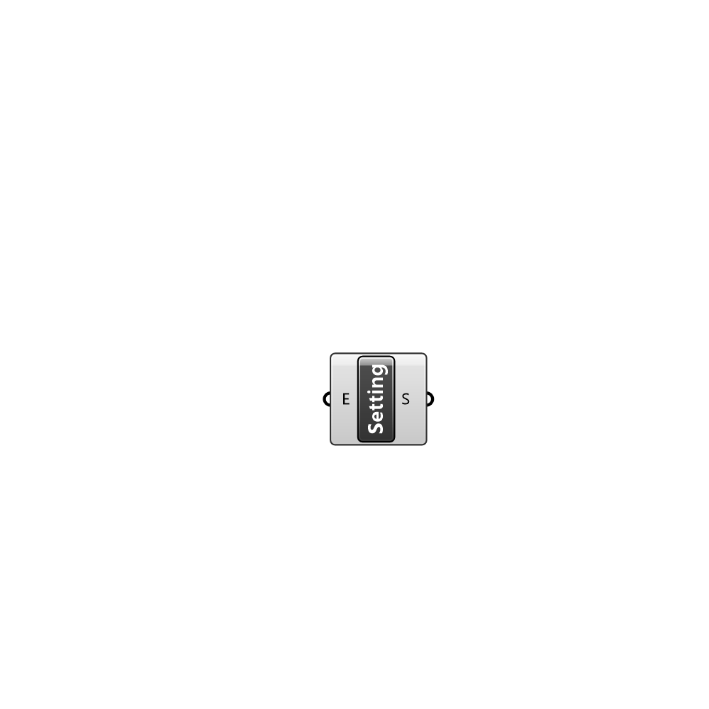

##  Create Setting

Creates a custom Setting instance. Settings contain a list of entries.

#### Input
* ##### E 
Entries to be added to the Setting.

#### Output
* ##### S
The created Setting instance.