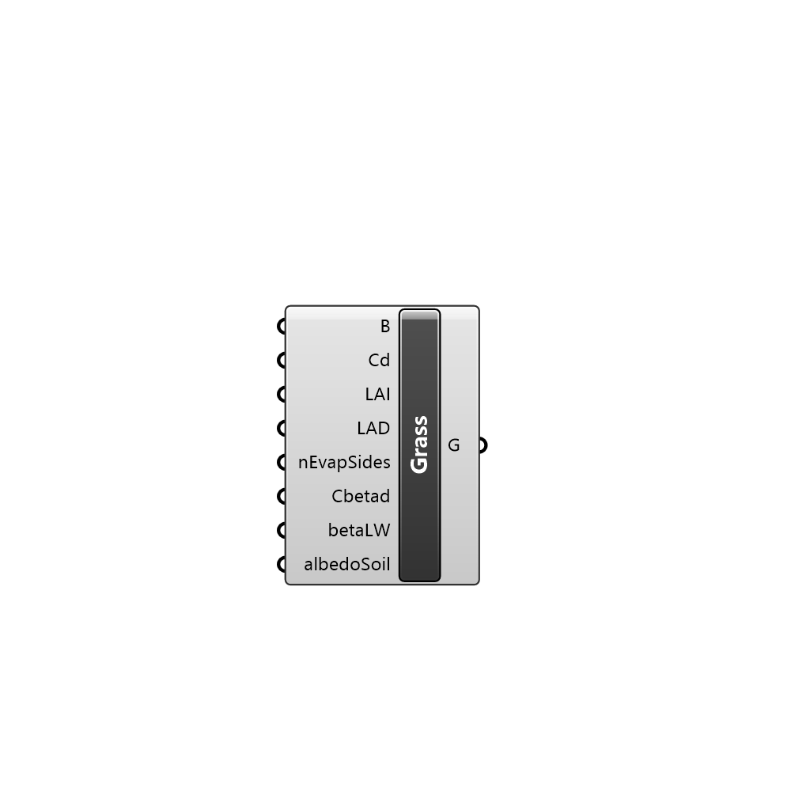

##  Grass

Creates grass in the simulation

#### Input
* ##### B 
Closed curve where grass will be added. This curve is projected to the terrain mesh to define the grass area
* ##### Cd 
Grass parameter 'Cd'
* ##### LAI 
Grass parameter 'LAI'
* ##### LAD 
Grass parameter 'LAD'
* ##### nEvapSides 
Grass parameter 'nEvapSides'
* ##### Cbetad 
Grass parameter 'beta'
* ##### betaLW 
Grass parameter 'betaLW'
* ##### albedoSoil 
Grass parameter 'albedoSoil'

#### Output
* ##### G
Grass parameters